# Frontline class-look concepts

Status: **production source and retained store-bundle material**. The selected
defaults—Trident Wasp, Aegis Tortoise, and Lattice Loom—ship from dedicated
internal class-form asset roots, so match rendering never depends on cosmetic
ownership. The other six chassis and their paired projectiles ship as locked
appearance packs. [`store-bundles.json`](store-bundles.json) is the exact
nine-pair source registry.

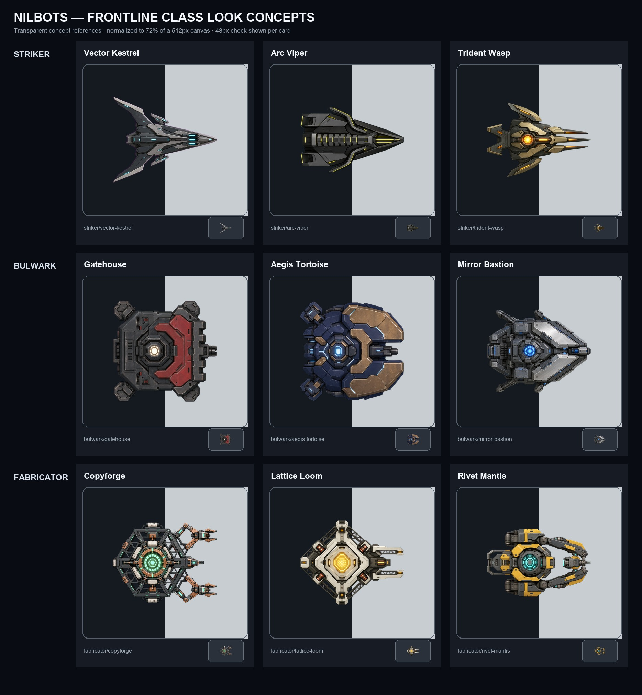

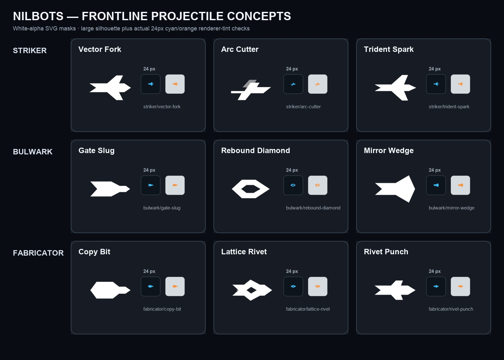

The concepts follow the active `agent/frontline-duel-depth` class direction:

- Striker is a narrow, facing-readable prediction duelist whose signature cast
  fires a three-lane volley.
- Bulwark is a broad fortifier with an obvious protected front, reversible
  turret commitment, and a facing-locked deflection shell.
- Fabricator is a light economy chassis that creates a **separate new instance
  of the same chassis** beside itself. It does not store children, attach them
  to itself, or grow through fabrication.

Every source is strict top-down, faces East, and was generated separately on a
flat magenta removal field. `source.png` is the untouched generated reference,
`concept.png` is the high-resolution transparent result, `preview.png` is
normalized to 72% of a canonical 512px canvas, and
`gameplay-preview.png` is the 48px legibility check.

## Candidate sets

| Class | Chassis concept | Paired projectile | Read |
| --- | --- | --- | --- |
| Striker | **Vector Kestrel** | Vector Fork | The speed extreme: long delta, three muzzle channels, least ground-bound of the set. |
| Striker | **Arc Viper** | Arc Cutter | Compact prediction wedge with curved calculation rails and the quietest volley cue. |
| Striker | **Trident Wasp** | Trident Spark | Strongest three-lane cast read; compact enough to remain a bot rather than artillery. |
| Bulwark | **Gatehouse** | Gate Slug | Heaviest mobile-door fantasy, strongest durability read, deliberately utilitarian. |
| Bulwark | **Aegis Tortoise** | Rebound Diamond | The clearest physical front quadrant and exposed rear; best match for Shell counterplay. |
| Bulwark | **Mirror Bastion** | Mirror Wedge | Sleeker deflection fantasy with a very reusable forward section for the derived turret. |
| Fabricator | **Copyforge** | Copy Bit | Most literal outward assembly tools; the busiest silhouette at gameplay scale. |
| Fabricator | **Lattice Loom** | Lattice Rivet | Repeatable lattice/hex language, distinct from both combat classes, and clear at 64px. |
| Fabricator | **Rivet Mantis** | Rivet Punch | Compact industrial manipulators and the strongest “mobile tool” read. |

The strongest base trio is **Trident Wasp + Aegis Tortoise + Lattice Loom**:
their silhouettes remain distinct without relying on player-controlled accent
color, and each says its class verb at a glance. A grittier alternative is
**Arc Viper + Gatehouse + Rivet Mantis**.

Projectile files under `projectiles/` are genuine white-alpha SVG masks on the
canonical 256 viewBox. A store purchase or grant contains the chassis and its
paired projectile together—the existing store trust rule—while the two remain
independently equipable after ownership. The three selected class defaults use
their pair automatically in class-form presentation:

- Trident Wasp → Trident Spark
- Aegis Tortoise → Rebound Diamond
- Lattice Loom → Lattice Rivet

<table>
  <tr>
    <th>Striker</th>
    <td>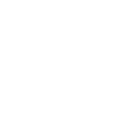<br>Vector Fork</td>
    <td>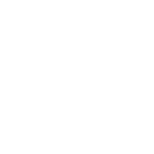<br>Arc Cutter</td>
    <td>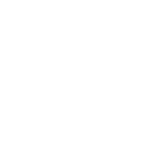<br>Trident Spark</td>
  </tr>
  <tr>
    <th>Bulwark</th>
    <td>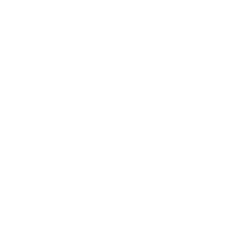<br>Gate Slug</td>
    <td>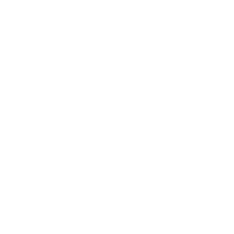<br>Rebound Diamond</td>
    <td>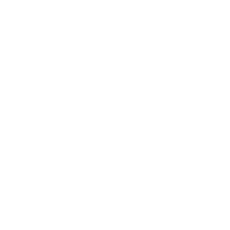<br>Mirror Wedge</td>
  </tr>
  <tr>
    <th>Fabricator</th>
    <td>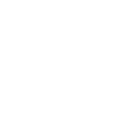<br>Copy Bit</td>
    <td>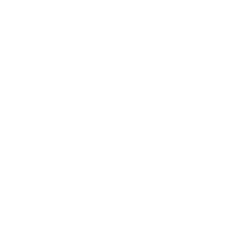<br>Lattice Rivet</td>
    <td>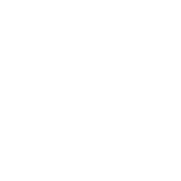<br>Rivet Punch</td>
  </tr>
</table>

## Runtime disposition

1. Every runtime chassis is a manual genuine SVG on
   `viewBox="0 0 512 512"`; none is an auto-trace of these raster references.
2. Trident Wasp supplies the Striker mobile and a separate three-barrel Volley
   body. Aegis Tortoise supplies mobile, omnidirectional turret, and directional
   Shell bodies. Lattice Loom is one identical chassis for every Fabricator
   life—the source never carries or grows a child.
3. Direct SVG surfaces tagged `data-team-accent="true"` are the only chassis
   paint the renderers substitute. Authored armor remains intact; the semantic
   team surfaces occupy a restrained share of each body.
4. The six alternate looks carry presentation-only `classId` metadata and
   complete paid chassis/projectile packs. The current account appearance
   contract does not yet enforce class compatibility, so owned alternates
   remain technically equipable outside their intended class until the
   first-class class contract supplies that enforcement.

Exact generation prompts and chroma-removal settings are in
[`SOURCE-PROMPTS.md`](SOURCE-PROMPTS.md). Rebuild normalized previews with:

```sh
python3 -m venv sandbox/concept-art-venv
sandbox/concept-art-venv/bin/pip install -r scripts/requirements-theme-art.txt
sandbox/concept-art-venv/bin/python scripts/build-class-look-concepts.py
```
