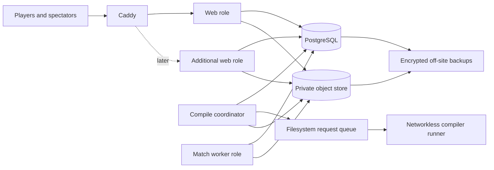

# nilbots deployment and scaling plan

Status: public-beta single-VPS path implemented; external object storage and
additional VPSs remain measured promotion steps.

Last updated: 2026-07-24.

## Goal

Launch nilbots cheaply on one Ubuntu VPS without creating a single-machine
dead end. The system should be able to grow into several VPSs, more workers,
and more web instances through deliberate deployment changes rather than a
rewrite.

This is a hobby project with credible upside, not a miniature cloud platform.
The plan therefore keeps the existing modular monolith, PostgreSQL job queue,
and Docker workflow. It adds boundaries where a later move between machines
would otherwise be painful.

## Decisions to make now

1. **Keep one modular monolith and one repository.** Web and worker roles may
   run as separate processes or containers, but they are deployment roles of
   the same application, not microservices.
2. **Use Docker Compose on the first VPS.** Do not introduce Kubernetes, a
   message broker, service discovery, or a database cluster before measurements
   justify them.
3. **Put Caddy at the public edge.** Only Caddy exposes ports 80 and 443. The
   app and PostgreSQL stay on private container or VPS networks.
4. **Keep PostgreSQL as the source of truth and job coordinator.** The existing
   database-backed queue is enough for this growth path.
5. **Treat durable blobs as objects, not host files.** Code talks through an
   object-store abstraction and PostgreSQL stores stable object keys. A local
   filesystem backend is acceptable on the first VPS; an S3-compatible backend
   is required before workers span multiple VPSs.
6. **Build and deploy immutable images tagged with the Git commit SHA.** Do not
   build an untracked production state by editing the VPS.
7. **Use one global match worker initially.** Compilation workers may scale
   horizontally first. Match workers scale only after rating/set finalization
   is transactionally idempotent.
8. **Use Linux x86-64 for build workers.** The pinned NativeAOT-LLVM compiler
   host is Linux x64, so an ARM VPS would add emulation and operational
   complexity for no useful gain.

Exact VPS, object-storage, private-network, and monitoring providers remain
replaceable choices.

## Architecture

All roles use the same domain model and PostgreSQL database. There are no
internal HTTP APIs between roles.



On the first VPS every solid component in the diagram is a Compose service on
one machine. Adding a VPS moves an existing role; it does not introduce a new
application boundary.

### Runtime roles

Introduce an explicit configuration such as:

```text
BOTARENA_ROLE=web
BOTARENA_ROLE=compile-worker
BOTARENA_ROLE=compiler-runner
BOTARENA_ROLE=match-worker
BOTARENA_ROLE=all
```

`all` is convenient for development. Production Compose should use explicit
roles even while they share one VPS:

- `web`: API, authentication, static site, and replay delivery; no job loops.
- `compile-worker`: claims compile jobs and coordinates PostgreSQL/object
  state with the filesystem request queue; does not invoke a compiler.
- `compiler-runner`: consumes one filesystem-queued compile request at a time;
  has the compiler toolchain but no network or application secrets.
- `match-worker`: claims match jobs only; starts with exactly one replica.
- `migrate`: a one-shot invocation used during deployment.

These are operational roles, not independent services. They remain in
`BotArena.App`, share migrations and models, and communicate only through the
existing database and object store.

## Implemented foundation and remaining gaps

| Area | Current strength | Gap before multiple VPSs |
| --- | --- | --- |
| Application | Explicit web, compile, match, migrate, and local `all` roles | Keep role compatibility across rolling upgrades |
| Jobs | PostgreSQL queue with claims, worker IDs, and renewable leases | Ranked-set finalization still limits match processing to one global consumer |
| Compilation | Networkless unprivileged runner, baked inputs, durable admission limits, deterministic cache keys, cgroup/tmpfs limits | Move the runner to a dedicated VPS if measured load or abuse warrants it |
| Matches | Deterministic WASM execution with fuel and memory limits | Forced-death retry and concurrent-finalization tests remain |
| Artifacts | Immutable, content-hashed objects behind `IObjectStore` | Local backend must become S3-compatible before workers move hosts |
| Replays | Stable object keys and authorization-gated streaming | Local backend remains a single-host dependency |
| Authentication | Shared provisioned OpenIddict certificates; Data Protection keys in PostgreSQL | Operational certificate rotation still needs rehearsal |
| Database | One-shot migration role and expansion-safe key migration | Backup restore rehearsal and monitoring remain |
| Edge | Caddy, trusted forwarded headers, secure cookies, live/ready health | External uptime alerting remains |
| Operations | Manual Actions release, two GHCR images, digest deployment, SBOM/provenance, backup/deploy runbooks | Off-host logical backup automation, log alerts, and restore rehearsal remain |

The first implementation work should remove these gaps without changing the
game architecture.

## Durable storage

### Object-store boundary

Add one small abstraction for immutable blobs, with operations equivalent to:

```text
Put(key, stream, expectedHash)
OpenRead(key)
Exists(key)
```

Prefer a generic name such as `IObjectStore`; artifacts and replays differ in
authorization and lifecycle policy, not in storage mechanics.

Initial implementations:

- `LocalObjectStore`, rooted under `BOTARENA_DATA`, for development and the
  first VPS.
- `S3ObjectStore`, for any S3-compatible external provider before a second VPS
  is introduced.

PostgreSQL should store keys rather than paths:

```text
artifacts/sha256/<artifact-hash>.wasm
replays/<match-id>.json
```

Rename or replace `ArtifactPath` and `ReplayPath` with `ArtifactKey` and
`ReplayKey` while there is no valuable production history to migrate. Workers
download WASM modules into a disposable local cache, verify the SHA-256 hash,
and then give Wasmtime the resulting local path. Build caches remain local and
disposable; correctness must never depend on a shared build cache.

### Replay secrecy

The object bucket must stay private. During a broadcast, the app must continue
to enforce the presentation clock and return a truncated replay. A public
object URL would bypass the no-spoiler invariant.

After `BroadcastComplete`, the app may either stream the full object or later
issue a short-lived signed URL. That optimization is not needed initially.

### Keys and secrets

Separate three concepts:

- Caddy certificate state: persistent so routine redeploys do not reissue
  certificates.
- ASP.NET Data Protection keys: explicitly persisted and shared by every web
  replica, preferably in PostgreSQL from the start.
- OpenIddict signing and encryption certificates: production-provisioned
  secrets shared by all web replicas. Development may generate local
  certificates, but production nodes must not independently generate them.

Object-store credentials, database credentials, and certificate passwords
must not be stored in Git. Start with a root-owned mode-0600 environment file
on the VPS; move to a secret manager only when the operating setup warrants
one.

## Job correctness and worker scaling

PostgreSQL `SKIP LOCKED` is deliberately suitable for queue-like tables with
multiple consumers. It prevents two workers from claiming the same available
row at the same instant, but it does not make all downstream side effects
exactly-once.

Before scaling workers:

1. Give each worker a stable instance ID and record it on claimed jobs.
2. Refresh the job lease while long work is running, or set and monitor a lease
   comfortably above the measured worst case.
3. Make completion safe to retry. A worker may die after saving domain state
   but before marking its job complete.
4. Make artifact uploads idempotent by object key and content hash.
5. Keep one global match worker until ranked-set finalization uses a database
   transaction plus a row/advisory lock or compare-and-set marker that proves a
   rating update was applied once.
6. Once finalization is idempotent, allow several match consumers to claim
   different matches. Preserve deterministic input snapshots and version axes.

Compile workers are the first safe horizontal scale unit. Separate workers may
compile the same content concurrently after a failure or lease expiry; the
content-addressed result makes this wasteful but correct.

During early deployments, drain workers before upgrading them. If rolling
worker upgrades become necessary, version job payloads and guarantee that
adjacent application versions can process the same queued work.

## Single-VPS production baseline

### Suggested host

Start with Ubuntu 26.04 LTS on an x86-64 VPS:

- workable beta minimum: 2 vCPU, 4 GB RAM;
- more comfortable starting point: 4 vCPU, 8 GB RAM;
- 40–80 GB SSD/NVMe, with disk alerts and off-site backups;
- one compile worker until measurements show spare CPU and memory.

Compilation is expected to be the burstiest load. Avoid sizing the whole
platform from idle web traffic alone.

### Compose services

The production Compose definition should contain:

- `caddy`
- `web`
- `match-worker` with one replica
- `compile-worker` coordinator with one replica
- `compiler-runner` with one replica and no network
- `postgres`
- persistent Caddy/PostgreSQL/object volumes

Only Caddy publishes host ports. PostgreSQL, web port 8080, and worker
processes stay on an internal Docker network. Persistent named volumes hold
PostgreSQL data, Caddy state, and the local object store while that backend is
in use.

Example edge configuration:

```caddyfile
{$BOTARENA_DOMAIN} {
    encode zstd gzip
    reverse_proxy web:8080
}
```

The domain's A/AAAA records point at the VPS, and inbound firewall rules allow
only SSH, HTTP, and HTTPS. The application must trust forwarded headers only
from the Caddy network and use the forwarded scheme when determining secure
cookies and public callback URLs.

### Host baseline

- Create a non-root operator/deployment user using SSH keys.
- Disable password SSH and direct root login after recovery access is tested.
- Enable a firewall; never expose PostgreSQL publicly.
- Apply unattended security updates with a deliberate reboot policy.
- Keep Docker and system logs size-limited.
- Do not mount the Docker socket into an application or worker container.
- Keep production secrets readable only by the deployment account/root.
- Put the server clock on reliable time synchronization; presentation clocks
  and token validity depend on it.

## Public-submission security gate

An internet-open programming game compiles hostile input by design. Public
registration is acceptable only while all of the following remain enforced:

- [x] The controlled build accepts sources only and never trusts the submitted
  project file.
- [x] Required compiler/NuGet inputs are baked into the worker image or a
  read-only cache so compilation runs without outbound network access.
- [x] Builds run as an unprivileged user with CPU, wall-clock, memory, process,
  file-size, and workspace-size limits.
- [x] The build workspace is disposable; the container has no web/auth secrets and
  no Docker socket.
- [x] The compiler runner has no container network and communicates through a
  bounded filesystem queue.
- [x] Request-size, account, network, account-queue, and global-queue limits are
  enforced; durable admission uses PostgreSQL locks.
- [x] Failed and timed-out builds cannot leave child processes or persistent
  workspaces.
- [x] WASM outputs are validated against the allowed ABI/import/memory contract
  before storage.
- [x] Hostile validation, queue recovery, real PostgreSQL admission, and real
  networkless compile tests pass.
- [ ] Dependency and base-image updates have a documented recurring cadence.

The runner is intentionally a sidecar on the first VPS. Moving it to a
dedicated x86-64 VPS is the next defense-in-depth step when queue latency, host
contention, or abuse makes that operational cost worthwhile; it is not a
public-beta prerequisite.

## Deployment and rollback

Use a deliberately boring release flow:

1. A manually triggered GitHub Actions workflow runs the full end-to-end
   suite. No push or pull-request trigger consumes the free Actions tier.
2. For a publish operation, build separate runtime and compiler images tagged
   with the full Git commit SHA and push them to GHCR with SBOM and provenance.
3. Take or verify a recent database backup.
4. Pass the resulting immutable image digests to the VPS.
5. Stop/drain workers.
6. Run the one-shot migration command exactly once.
7. Start web and workers with the new image.
8. Wait for readiness, then run a login/API check and one deterministic smoke
   match.
9. Retain the previous image tag for rollback.

Database changes should use expand/contract migrations whenever a rollback may
cross a schema change. A rollback must never silently reinterpret rules,
runtime versions, artifacts, or replays.

Do not use `Database.Migrate()` from every web/worker startup in a multi-node
deployment. Seeding should also be explicit or idempotent under concurrent
startup.

## Backups and recovery

Initial hobby-project targets:

- recovery point objective: at most 24 hours of database changes lost;
- recovery time objective: restore service within a few hours;
- nightly encrypted PostgreSQL backup to a different provider or location;
- daily backup or provider versioning for local objects;
- retain at least 7 daily and 4 weekly recovery points;
- retain the signing/encryption and Data Protection keys needed for token and
  cookie continuity;
- test a restore into a disposable environment at least quarterly.

The backup job is not complete because a file exists. It is complete only when
the file is off-host, encrypted, monitored, and has passed a restore test.

Before public competitions or meaningful paid usage, improve the database RPO
with more frequent logical backups or WAL archiving and write a short incident
runbook.

## Health, logs, and measurements

Add:

- `/health/live`: the process is alive; no dependency checks.
- `/health/ready`: the role can do useful work, including its required database
  and object-store access.
- structured logs containing request/job/match IDs but never submitted source,
  tokens, passwords, or connection strings;
- log rotation;
- one external HTTPS uptime check;
- alerts for failed backups, repeated job failure, disk pressure, and an
  unavailable web endpoint.

Measure before scaling:

- HTTP request rate, p95 latency, and 5xx rate;
- database connections, slow queries, storage, and backup age;
- queue depth and age of the oldest compile/match job;
- compile duration, failure rate, CPU, memory, and disk workspace usage;
- match duration, failure rate, runtime faults, and worker utilization;
- object-store latency/errors and replay sizes.

Start with host metrics, application logs, and a few database queries. Add a
full metrics stack or distributed tracing only when diagnosis with those tools
becomes materially difficult.

## Scaling ladder and promotion triggers

### Stage 1: one VPS, public beta

Everything runs in one Compose project. Registration is public, compiler
admission is bounded, and the compiler runner is offline. Use local object
storage with off-site backups. Keep one compile and one match worker.

Promote only after real usage shows a reason: register, submit, play, watch,
monitor queue pressure, and survive a restore test—not merely when the
homepage loads.

### Stage 2: first additional VPS

The likely first bottleneck is compilation. Move the compilation coordinator
and its networkless runner together to a second x86-64 VPS connected over a
provider-private network or WireGuard/Tailscale. Keep their filesystem queue
local to that host. Switch artifacts and replays to the private S3-compatible
store first. PostgreSQL may remain on the original machine, reachable only
over the private network and firewall-restricted to known hosts.

Add a compile worker when any of these persist under normal use:

- oldest compile job waits more than roughly one minute;
- compile bursts keep host CPU above about 70%;
- memory pressure or OOM events threaten the web/database roles;
- builds noticeably degrade spectator/API latency.

### Stage 3: horizontal web capacity

Run two or more `web` roles behind Caddy only after shared keys, object
storage, one-shot migrations, and role separation are complete. Configure
Caddy health checks and the app's trusted-proxy policy. Move rate limiting to
the edge or a shared counter if per-node limits can be multiplied into an
abuse problem.

Add a web instance when p95 API latency or availability is poor while the
database and workers are healthy. One Caddy instance can remain the edge for
considerable traffic; this stage adds capacity, not full high availability.

### Stage 4: database separation

Move PostgreSQL to its own VPS or a managed service when database resource
contention, backup burden, or desired recovery time—not fashion—justifies it.
Prefer one well-backed-up primary over a self-managed cluster. Add a connection
pooler or read replicas only after connection or read measurements demonstrate
the need.

### Stage 5: higher availability

Only pursue redundant edge nodes, automated failover, multi-zone databases,
or an orchestrator after downtime has a real user or revenue cost. Capacity
across several VPSs is not automatically high availability: DNS, Caddy,
PostgreSQL, and object storage can each remain a single failure point.

## Implementation order

### Milestone A — scale-ready application boundaries

- [x] Add explicit web/compile-worker/compiler-runner/match-worker/migrate
      roles.
- [x] Stop starting `JobWorker` in every web process.
- [x] Add `IObjectStore` plus local implementation.
- [x] Migrate artifact/replay database fields from host paths to object keys.
- [x] Make workers materialize and hash-check artifacts in a local cache.
- [x] Persist ASP.NET Data Protection keys explicitly.
- [x] Make production OpenIddict certificates provisioned, shared secrets.
- [x] Add liveness/readiness endpoints.
- [x] Configure trusted proxy headers and secure cookies.
- [x] Move migration/seeding out of normal multi-node startup.

### Milestone B — reproducible single-VPS deployment

- [x] Add production Compose configuration with Caddy and explicit roles.
- [x] Build separate immutable runtime/compiler image targets tagged by commit
      SHA and deploy them by registry digest.
- [x] Add a manual-only GitHub Actions verify/publish/deploy workflow.
- [x] Publish SBOM and provenance attestations with both GHCR images.
- [x] Add a documented `.env.example` containing names, never secrets.
- [x] Add database/object backup and restore runbook plus database backup script.
- [x] Add deployment, health smoke-test, and rollback commands.
- [ ] Add log rotation, uptime check, and minimum alerts.
- [ ] Run and record a restore rehearsal.

### Milestone C — public submission hardening

- [x] Vendor/cache all required compiler inputs into the image.
- [x] Disable build-time outbound networking.
- [x] Add cgroup memory plus CPU/PID/file/workspace limits.
- [x] Ensure cleanup survives cancellation, timeout, and worker death.
- [x] Confirm the compiler runner receives no web/auth secrets.
- [x] Add durable account/network/queue admission limits.
- [x] Validate produced WASM before accepting it.
- [x] Publish build receipts and immutable artifacts without exposing source.
- [x] Run hostile-input, queue-recovery, PostgreSQL-concurrency, and real
      networkless compiler tests.

### Milestone D — second-VPS readiness

- [ ] Add and test the S3-compatible object-store backend.
- [ ] Move a compiler runner/coordinator across a private VPS network if
      measurements justify it.
- [x] Add worker IDs and lease renewal.
- [ ] Prove compile job retry/idempotency through forced worker termination.
- [ ] Make ranked-set finalization transactionally exactly-once before adding
      a second match worker.
- [ ] Exercise a mixed-version/drained-worker deployment.

## Explicitly not now

- Kubernetes or Nomad
- Microservices or internal HTTP APIs
- RabbitMQ, Kafka, or Redis as a job broker
- Self-managed multi-primary PostgreSQL
- Shared network filesystems between VPSs
- Autoscaling
- Multi-region active/active operation
- A full observability platform before basic metrics and logs prove inadequate

Each may become reasonable later, but none is required to reach a healthy
multi-VPS nilbots deployment.

## References

- [Caddy automatic HTTPS](https://caddyserver.com/docs/automatic-https)
- [Caddy reverse proxy](https://caddyserver.com/docs/caddyfile/directives/reverse_proxy)
- [ASP.NET Core web-farm guidance](https://learn.microsoft.com/en-us/aspnet/core/host-and-deploy/web-farm?view=aspnetcore-10.0)
- [ASP.NET Core health checks](https://learn.microsoft.com/en-us/aspnet/core/host-and-deploy/health-checks?view=aspnetcore-10.0)
- [PostgreSQL `SELECT`, including `SKIP LOCKED`](https://www.postgresql.org/docs/current/sql-select.html)
