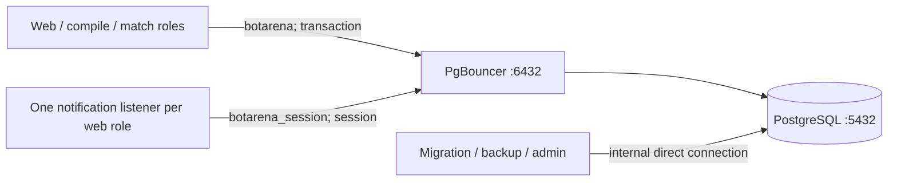

# PostgreSQL connection and operations plan

Status: implemented and locally verified; production rollout/acceptance pending.

Last updated: 2026-07-28.

## Outcome

Add PgBouncer before more application nodes multiply independent Npgsql
connection pools. Keep PostgreSQL as one well-backed-up primary and preserve
the existing PostgreSQL job queue, transactions, and `LISTEN`/`NOTIFY`
behavior.

This is connection fan-in and backpressure, not database high availability.
PgBouncer remains on the PostgreSQL primary until database separation is
justified.

The production snapshot taken while drafting this plan showed seven idle
application connections against PostgreSQL's `max_connections = 100`. There is
no immediate exhaustion incident. The risk is structural: Npgsql pools are
per process and default to a maximum of 100 connections, while nilbots already
runs several database-using roles across multiple VPSs.

## Target topology

PgBouncer exposes port 6432 only on the primary's provider-private address and
only to registered worker `/32`s. PostgreSQL stops publishing 5432 to worker
hosts after the compatibility window. PostgreSQL remains reachable directly
inside the primary's Compose backend network for migration, backup, and
administration.

PgBouncer presents two client-side database names that target the same
`botarena` PostgreSQL database:

- `botarena` uses transaction pooling for normal EF Core and worker traffic.
- `botarena_session` uses session pooling only for the long-lived notification
  listener. PostgreSQL `LISTEN` is not compatible with transaction pooling.

The application continues to execute `NOTIFY` through ordinary transactions.
Only the listener connection needs session affinity.

## Initial connection budget

Start deliberately below PostgreSQL's current 100-connection ceiling:

| Layer | Initial limit | Purpose |
| --- | ---: | --- |
| Npgsql application pool | 20 per process | Bound clients and make saturation visible |
| PgBouncer clients | 300 total | Admit bursts while PgBouncer queues backend work |
| `botarena` transaction pool | 30 + 5 reserve | Normal API and worker queries |
| `botarena_session` session pool | 10 | Up to ten web notification listeners |
| PostgreSQL | 100 unchanged | Leave headroom for migration, backup, admin, and recovery |

These are safe starting budgets, not performance truths. Tune them from
PgBouncer wait time, Npgsql pool wait time, PostgreSQL CPU/locks, and request or
job latency. Raising PostgreSQL `max_connections` is not the first response to
queueing.

Use SCRAM authentication. Generate PgBouncer's root-owned authentication file
from PostgreSQL's existing SCRAM verifier without logging it or committing it.
Password rotation must update PostgreSQL, regenerate the PgBouncer verifier
file, reload PgBouncer, and prove new and existing connections.

Pin the PgBouncer image by version and digest. Keep a non-root user, read-only
root filesystem, dropped capabilities, bounded memory/PIDs, bounded logs, and
a health check that authenticates through the pool.

## Rollout checklist

### Phase 0 — baseline and tests

- [x] Record connection counts by application role and client address.
- [x] Record PostgreSQL `max_connections`, peak active connections, transaction
      duration, lock waits, and slow-query baseline.
- [x] Audit application SQL for session-scoped `SET`, temporary tables,
      session advisory locks, SQL `PREPARE`, and cursors that cross
      transactions.
- [x] Keep `LISTEN` isolated in `PostgresNotificationListener`; it must not use
      the transaction-pooled connection.
- [x] Add a PgBouncer integration fixture to CI without adding an automatic
      GitHub Actions trigger.
- [x] Prove EF transactions, `FOR UPDATE SKIP LOCKED` job claims, concurrent
      finalization, OpenIddict, and PostgreSQL Data Protection through
      transaction pooling.
- [ ] Prove `LISTEN`/`NOTIFY` delivery through the session alias with at least
      two web processes.

### Phase 1 — Compose and secrets

- [x] Add a primary-only `pgbouncer` service to
      `deploy/compose.production.yml`.
- [x] Add a pinned configuration with explicit database aliases, pool modes,
      connection budgets, timeouts, admin/stats users, and prepared-statement
      support.
- [x] Generate the PgBouncer auth file under persistent root-owned shared
      secrets; never place a password or verifier in the release bundle.
- [x] Make PgBouncer depend on healthy PostgreSQL and make application roles
      depend on healthy PgBouncer.
- [x] Give migrations a direct internal PostgreSQL connection and keep
      `backup-postgres.sh` direct through the database container.
- [x] Add health and bounded-resource tests to the release/Compose test suite.

### Phase 2 — application connection split

- [x] Route the main `AppDbContext`/Npgsql data source to
      `botarena@pgbouncer:6432`.
- [x] Add a separately named notification connection targeting
      `botarena_session@pgbouncer:6432`.
- [x] Set an explicit, configurable Npgsql maximum pool size and application
      name per role/instance.
- [x] Keep ordinary query state transaction-scoped; do not compensate for
      incompatible session state with fragile reset settings.
- [x] Make readiness fail when the role cannot execute a trivial query through
      its required pooled path.
- [x] Verify reconnection and readiness recovery after PgBouncer is restarted
      without restarting PostgreSQL.

### Phase 3 — worker lifecycle and network cutover

- [x] Render worker database settings with primary-private port 6432 rather
      than PostgreSQL port 5432.
- [x] Change bootstrap verification to authenticate and query through
      PgBouncer.
- [x] Change worker add/remove firewall policy to exact `/32` access for 6432.
- [x] Preserve direct 5432 worker access during one mixed-version deployment
      window so an older worker can roll back.
- [ ] Deploy the primary, then every registered worker, and prove all active
      releases use PgBouncer.
- [ ] Remove worker PostgreSQL HBA entries and close private host port 5432
      only after the whole fleet passes health and smoke tests.
- [x] Ensure a paused/unregistered worker loses PgBouncer network admission and
      is absent from future GitHub deployments.

### Phase 4 — production acceptance and rollback

- [ ] Load enough concurrent clients to exceed the backend pool size and prove
      they queue rather than exceed the configured PostgreSQL budget.
- [ ] Confirm PgBouncer `SHOW POOLS`, `SHOW STATS`, and PostgreSQL
      `pg_stat_activity` agree with the intended limits.
- [ ] Exercise PgBouncer restart, PostgreSQL restart, primary deploy, failed
      worker deploy, worker drain/resume, and password rotation.
- [ ] Run registration, login, API, bot submission, compile, match,
      notification, SignalR, and deterministic replay smoke tests.
- [x] Keep the prior direct-connection release and firewall/HBA restoration
      commands until the cutover has survived a full release cycle.
- [x] Document the rollback: restore direct connection settings, reopen only
      exact worker `/32`s on 5432, restore their HBA rules, and restart roles.
- [x] Deploy only through the manual `publish-and-deploy` workflow after the
      existing CI and release verification jobs pass.

## Observability and alerts

Add useful signals without deploying a full monitoring platform yet:

- PgBouncer client count, active backend count, queued clients, maximum wait
  time, query/transaction rate, and pool errors.
- PostgreSQL active/idle connections, long transactions, blocked queries,
  deadlocks, cache/I/O behavior, database size, and autovacuum health.
- Npgsql pool used/idle/waiting counts by role without connection strings or
  passwords as metric labels.
- Alerts for sustained PgBouncer queueing, connection-budget exhaustion,
  long-running or blocked transactions, stale/failed backups, disk pressure,
  and failed readiness.

The external HTTPS check must remain outside the primary VPS. Monitoring the
primary only from containers on the primary cannot detect loss of the host or
provider network.

## PostgreSQL extensions and companion services

### Add now

#### `pg_stat_statements`

This is the one PostgreSQL extension worth installing immediately. It gives a
normalized view of query frequency, total/mean execution time, rows, and
buffer/WAL behavior. Use:

- `shared_preload_libraries = 'pg_stat_statements'`;
- `compute_query_id = on`;
- `pg_stat_statements.track = top`;
- planning statistics off initially;
- a bounded statement count and a documented reset/snapshot procedure.

It requires a PostgreSQL restart and `CREATE EXTENSION` in `botarena`. Keep
parameter logging disabled and do not expose the statistics view publicly.

Also enable conservative built-in logging for lock waits, deadlocks,
checkpoints/autovacuum problems, and statements over a useful slow-query
threshold. Begin around one second and tune from volume. Do not log all
statements or parameters.

### Add when there is a metrics destination

`postgres_exporter` is the conventional Prometheus bridge and should use a
dedicated least-privileged role with `pg_monitor`, a password file, and no
published metrics port. Add it only when Prometheus-compatible monitoring
actually exists; an exporter with nobody scraping or alerting on it adds no
operational value.

PgBouncer's admin console and Garage's authenticated metrics endpoint should
feed the same future collector. A small Prometheus/Grafana/Alertmanager stack
may later live in Compose, but only after memory headroom and alert ownership
are clear. Prefer an external alert receiver so primary-host failure can still
notify us.

### Defer until a measured need

- `auto_explain`: load temporarily, or enable with a high threshold and
  sampling, when `pg_stat_statements` identifies a query that needs its plan.
  Never enable blanket `ANALYZE`/timing in production without measuring the
  overhead.
- `pgAudit`: add only for a real compliance, financial, or privileged-admin
  audit requirement. Nilbots product events should remain explicit
  application audit records; logging every SQL read/write would add volume and
  may capture sensitive data without expressing product intent.
- `pg_cron`: do not add. Nilbots already has a durable PostgreSQL-backed job
  system, while host-level backup and maintenance jobs must still work when
  the application database is unhealthy.
- `pg_partman`: consider only after a large append-heavy table has a concrete
  retention/partitioning requirement.
- `pg_repack`: use as an operational repair tool only when measured table or
  index bloat warrants it.
- PostGIS, pgvector, TimescaleDB, and similar domain extensions: no current
  Nilbots requirement.
- Patroni, repmgr, read replicas, and self-managed automatic failover: defer
  until downtime has a user/revenue cost and there is a tested backup/restore
  foundation.

## Backup path and accepted hobby risk

Paid off-site storage is consciously deferred while nilbots remains a hobby
project without valuable production history. During this phase, loss of the
primary VPS or its disk may lose PostgreSQL, local dumps, and the co-located
Garage cluster together. Local backups are still useful for bad migrations,
accidental deletion, and operator mistakes, but they are not disaster
recovery.

Keep the no-cloud-tax baseline honest:

- [x] Schedule the current custom-format `pg_dump` locally.
- [ ] Alert on local backup failure and age.
- [x] Retain a capacity-bounded set of 32 local recovery points (pre-deploy and
      nightly); tune the count from measured dump size and disk headroom.
- [x] Restore a local dump into a disposable database weekly and in CI.
- [x] Keep backup data outside the live PostgreSQL volume so database-volume
      corruption does not automatically destroy both.
- [ ] Monitor total disk usage so retained dumps cannot take production down.

Promote to encrypted off-site backups when any one of these becomes true:

- production history would be painful to recreate;
- a public competition, payment, or meaningful user-generated history exists;
- losing the primary would be more expensive than recurring backup storage;
- PostgreSQL moves to another host or provider;
- the accepted recovery point becomes materially shorter than the local dump
  cadence.

At that promotion, use a different provider/failure domain and test retrieval.
Move to pgBackRest or WAL-G with WAL archiving and point-in-time recovery only
when the required RPO justifies the added machinery. The co-located Garage
cluster must never be described as an off-site backup.

## Promotion gates

PgBouncer is complete only when:

- every normal application role uses the transaction alias;
- every web notification listener uses the session alias;
- migrations/backups remain direct and tested;
- PostgreSQL is no longer reachable from workers on 5432;
- registered-worker bootstrap, drain, pause, resume, and GitHub deployment
  still work;
- connection limits and queue alerts are observable;
- a forced PgBouncer restart recovers automatically; and
- the direct-path rollback has been rehearsed.

The current hobby PostgreSQL operating baseline is complete after
`pg_stat_statements`, monitored local dumps, and one disposable restore
rehearsal are in place. Disaster recovery remains explicitly incomplete until
the off-site promotion gate is crossed.

## Primary references

- [PgBouncer feature compatibility](https://www.pgbouncer.org/features.html)
- [PgBouncer configuration](https://www.pgbouncer.org/config.html)
- [Npgsql connection parameters](https://www.npgsql.org/doc/connection-string-parameters)
- [Npgsql basic usage and pooling](https://www.npgsql.org/doc/basic-usage.html)
- [PostgreSQL 16 `pg_stat_statements`](https://www.postgresql.org/docs/16/pgstatstatements.html)
- [PostgreSQL 16 `auto_explain`](https://www.postgresql.org/docs/16/auto-explain.html)
- [Prometheus PostgreSQL exporter](https://github.com/prometheus-community/postgres_exporter)
- [pgBackRest user guide](https://pgbackrest.org/user-guide.html)
