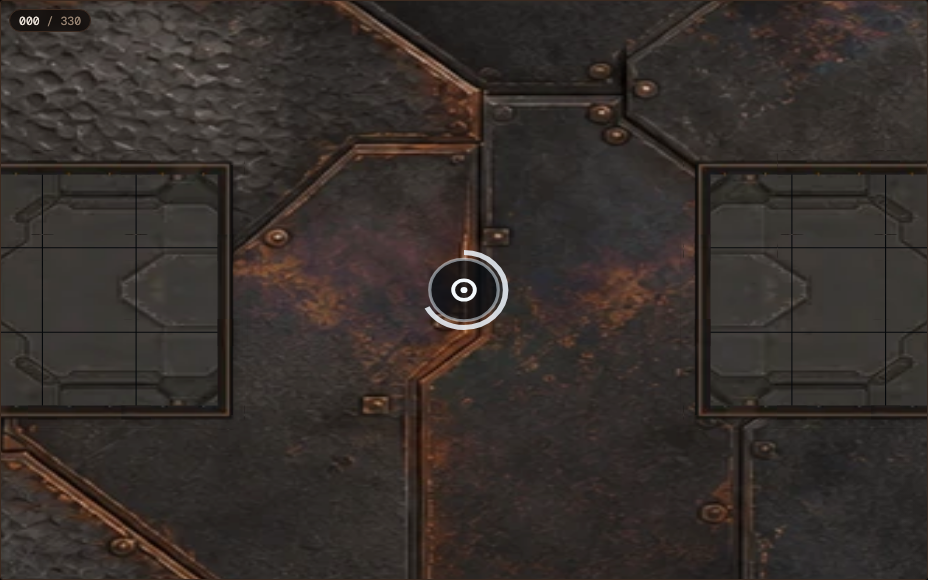

DECISION NEEDED: Watch the fresh twelve-match blind gallery and judge whether
Core returns now read as purposeful and whether reverse/lateral travel reads as
intentional locomotion. The measured execution defect is repaired; human
enjoyment and final game depth remain owner judgments, and no fun claim is made.

# Arc Relay flow + intent pass — 2026-08-02

## RESULT

The near-reactor Core stall was reproducible and systemic. It was not a map
geometry or Convoy-only problem. Re-scoring the current 160-match, 32-sheet
population under a progress-aware detector found 51 affected matches and 22
affected sheets; the worst carrier spent 520 uncontested ticks near a legal
bank without reaching a closer path distance. The prior presentation gallery
also contained two such failures despite its “all eligible” claim.

The cause was allied traffic plus an incomplete fallback. The shared executor
treated every allied tile as a routing obstacle, while screen and escort bodies
already inside their preferred spacing correctly held position. A carrier then
routed around its own bank or oscillated across equal-distance tiles. Its old
fallback counted only consecutive ticks held by one life on one exact tile, so
every one-tile sidestep erased the evidence.

The repair is a new versioned evaluation executor, not a game mechanic:

- carriers reserve their terrain-shortest next return tile and their reactor;
- an allied non-carrier on either tile yields through an ordinary legal move;
- a carrier that has made no distance progress commits to its static shortest
  step for a bounded window instead of alternating laterally;
- the bounded window returns to ordinary routing so a persistent spawn claim or
  other real reservation can still be routed around; and
- progress state belongs to the actor/Core pair, so a new Core does not inherit
  stale traffic state.

No rule, map tile, class value, signature, cadence, score, comeback mechanic,
economy, sheet, or doctrine changed. The candidate WASM SHA-256 is
`e945f8ad34ef350c5995a480d4793466a751aef1e5a32f29c045254583311f42`.

The repair generalizes across the frozen population: all 160 current cells are
eligible and canonical-replay verified on WASM. The worst home non-progress run
is now 29 ticks, below the 30-tick bar; p95 is 14. The eight deliberately worst
historical cells are 8/8 clean, with the former 510–520-tick Pod Lattice cases
both reduced to 14.

Canvas2D locomotion now carries the authoritative displacement as explicit pose
metadata, independent of facing. Position still uses the existing linear A→B
tween and never leaves its replay segment. The renderer adds persistent
class-owned wheel/tread/skid/hover wakes, a small movement lift, and chassis-
fixed drive light whose exhaust points opposite actual displacement. Facing and
the nose marker stay authoritative. A bot moving backward therefore visibly
uses reverse thrust rather than silently sliding nose-first in the wrong visual
direction; lateral travel receives the same truthful treatment.

## EVIDENCE

### 1. Detector correction

`balance/arc-relay-felt-degeneracy-bars-v3.json` adds one cohort-eligibility
bar while preserving every v2 bar and threshold:

| Home-carrier non-progress field | Frozen value |
| --- | ---: |
| Home radius | 6 static, corner-safe eight-way path tiles |
| Enemy contest pause | Chebyshev distance 2 |
| Trip point | 30 uncontested ticks without a new best distance |
| Allied handoff | same team episode; does not reset |
| Equal-distance movement | does not reset |
| Strictly lower static distance | progress; starts a new run |

Enemy presence pauses rather than clears progress debt. This prevents a real
fight from being labelled passive while ensuring a brief contest cannot launder
an otherwise indefinite home orbit. Synthetic tests cover exact oscillation,
allied handoff continuation, strict progress, and contest pause.

The sweep harness previously recorded an eligibility-bar path and hash but did
not pass that frozen path to the scorecard; the scorecard used its hardcoded
default. Plans now resolve and hash either the cohort-declared registration or
an explicit override, the runner validates the frozen file/hash, and every cell
passes that exact path to the scorecard. Historical v1 plans remain readable:
missing later bars are disabled rather than silently substituted.

| Retrospective source | Matches tripped | Entrants tripped | Worst run |
| --- | ---: | ---: | ---: |
| Prior presentation gallery | 2/12 | 2 sides | 496 ticks |
| Current 32-sheet population, old executor | 51/160 | 22/32 | 520 ticks |
| Eight worst-case candidate gate | 0/8 | 0 | 14 ticks |
| Full candidate population | 0/160 | 0 | 29 ticks |

### 2. Population and balance guardrails

The final 160 cells use the same seed, 80 frozen pairs, both assignments,
ruleset, map profile, and 32 sheet payloads as the existing sparse population
screen. Only the shared participant artifact changed.

| Read | Result |
| --- | ---: |
| Runtime / verified canonical replays | WASM / 160 of 160 |
| Cohort eligibility | 160 of 160 |
| Draws | 3/160 (1.88%) |
| Winning sheets | 32/32 |
| Leader share of decided wins | Sensor Grid, 10/157 (6.37%) |
| Mirrored pairs split 1–1 | 32/80 |
| Mirrored 2–0 sweeps | 45/80 |
| End tick median / mean | 426 / 422.575 |
| MaxTicks matches | 6/160 (3.75%) |
| First-Pulse conversion | 114/160 (71.25%) |

The first-Pulse read improved from 75.63% but remains above the registered 70%
alert. It is disclosed, not tuned in this pass. All sheets still win at least
one of their ten sparse-neighborhood games, and the same leader remains well
inside the provisional 15% ceiling. This is shared-mind evaluation evidence,
not product-balance or human-depth authority.

Frozen evidence hashes:

| Artifact | SHA-256 |
| --- | --- |
| v3 bar registration | `7a32179220246997c37a40bcf9a5731f8ccc1c5f6cd50076439023274fe22ce4` |
| flow-intent registration | `6cc0895ef185a8ebfc86f12adc7e9dc3de0fbac8d75d65e8b3f539a05d82cef6` |
| candidate cohort | `007066ca5fef26c9b3906809de7861d740bed5c9568ad57c2fdfce8edb600142` |
| 160-cell plan | `25bd693941ccd0dd4bd9ab39674dade387051dbe0e2c166e3c3746d5e2256a07` |
| 160-cell results | `85981c40e76be20fc9fed97617aba88fcd73d574ed5049e45ec32d9c850f5b05` |

The 160-cell run completed in 284.638 seconds with eight workers. That is audit
orchestration time including canonical regeneration, verification, broadcast
production, and scorecards; it is not live match-server latency.

### 3. Renderer truth

`BotPose.motionX/motionY` are the exact tick endpoint difference. They do not
modify facing, fog, action timing, collision, hit timing, or any replay state.
The movement cues stay visible through the whole A→B segment instead of fading
to zero at every integer boundary, which removes the repeated stop/start read
across consecutive moves. Grounded classes retain distinct dust, track, and
skid treatments; hover classes retain their air gap and ring and now leave twin
team-accented wakes when moving.

The production browser smoke found an actual authoritative reverse at tick 1:
actor `1:6:0` faced west while moving one tile east. The page advanced normally,
raised no browser errors, and captured the rendered frame at SHA-256
`5e6f320bd0b0bf2202e33410e13dbddcebd7073fbac5c06ba3dd084ba17ab3b2`.

### 4. Fresh blind gallery

The replacement review set was frozen before its second-seed outcomes. It uses
six deliberately different evaluation matchups in both assignments: Convoy vs
Interception, Smoke Convoy vs Fortress Counterattack, Relay Chain vs Control
Grid, Courier Sprint vs Trap Punish, Rotating Bastions vs Three-Well Race, and
Null Veil vs Breach Column. Its index order was independently shuffled with
seed `86020802` and contains no outcome, score, or duration.

| Gallery fact | Result |
| --- | ---: |
| Campaign seed | `67867967` |
| Matches / eligible / verified | 12 / 12 / 12 |
| Largest compressed match | 213,742 B (limit 300 KiB) |
| Whole hosted gallery | 6,636 KiB (limit 8 MiB) |
| Gallery plan SHA-256 | `a97dd860c110bc42a1d2993ab0e5b86255951da9c4fbe484e5a4d8b41dd05391` |
| Gallery results SHA-256 | `a4238286cf269e6e2940df798965e9fda0c886d88a200307545088fac771c62b` |

The gallery is under
`sandbox/arc-relay-flow-intent-review-v1-2026-08-02-engine-1-0-5` and is served
with pre-compressed replay siblings. Every gallery source record retains the
same canonical hash verified by its sweep cell; presentation changes never
touch canonical replay content.

### 5. Verification

| Check | Result |
| --- | --- |
| Scorecard tests | 9/9 pass |
| Candidate build | pass, canonical WASM artifact hash matches cohort |
| Worst-case candidate sweep | 8/8 eligible and verified |
| Full population sweep | 160/160 eligible and verified |
| Fresh blind sweep | 12/12 eligible and verified |
| Web tests | 355/355 pass |
| Renderer goldens | intentionally re-recorded on Darwin ARM64 and Linux x64 |
| Full production web build | pass, including four CLI viewers and parked 3D |
| Gate 3 gallery build | pass |
| DocDrift | 24/24 pass |
| Production browser smoke | pass, zero page errors |
| Public gzip delivery | HTTP 200 with `Content-Encoding: gzip` |

## NEXT

1. The owner watches the replacement gallery and rules on flow and locomotion.
2. Keep the 32-sheet population as an evaluation corpus; do not convert it into
   the player-facing sheet schema before the dedicated post-Gate-3 UX pass.
3. If the review still finds silly play, identify the exact sample/tick and add
   a detector before changing rules or thresholds.
4. Treat first-Pulse conversion and broader human depth as separate registered
   goals. This pass supplies a cleaner substrate; it does not settle either.
