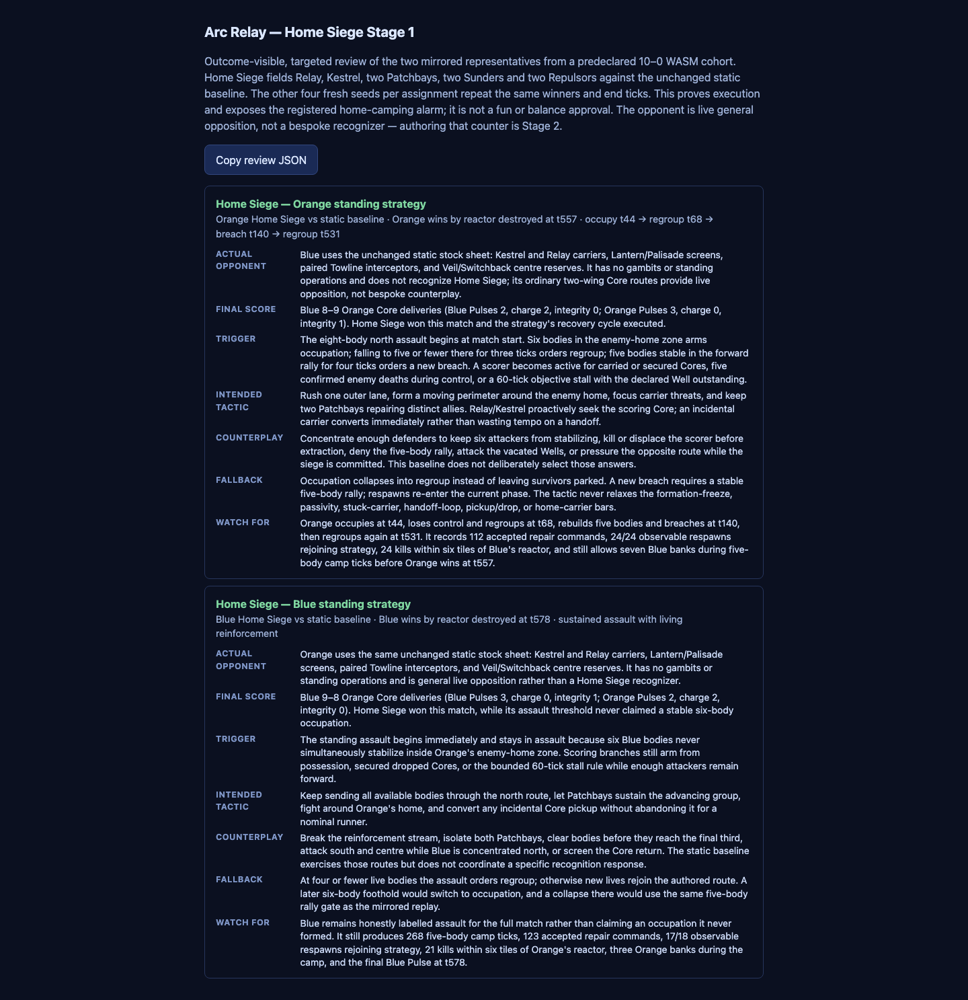
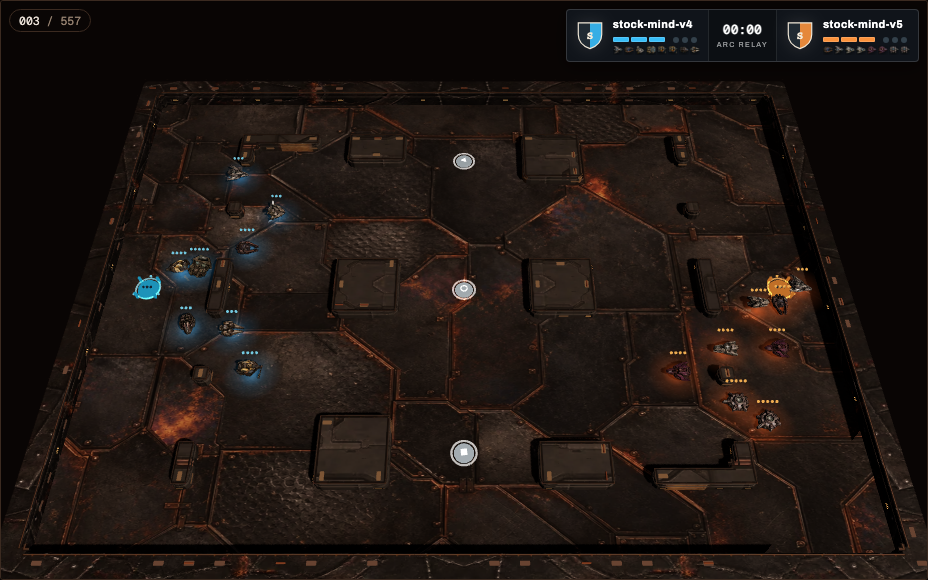
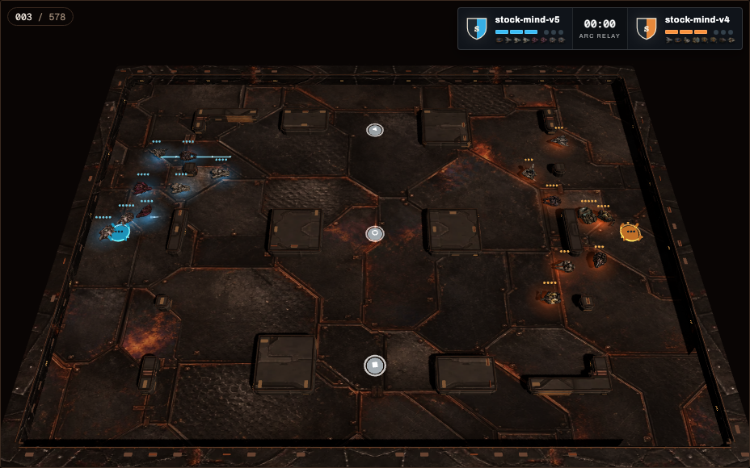

DECISION NEEDED: Accept Stage 1 as a standing-strategy grammar proof and a simultaneous Home-camping-dominance alarm, then commission the separately gated Stage 2 recognizer before changing the map or rules.

# Arc Relay Home Siege sheet pass

Date: 2026-08-03

Branch: `codex/arc-strategy-ladder`

Accepted source/base: `2ff34f16005da75ddff4e6289c817fa37d57d303` (`Tighten Arc Relay strategy ladder gates`)

Implementation freeze commit: `48c5526b` (`Add provisional Arc Relay standing strategy grammar`)

Public review: <https://conclude-involve-inspired-insertion.trycloudflare.com> (public, unauthenticated, ephemeral Cloudflare quick tunnel)

## RESULT

Home Siege beat the unchanged static baseline **10–0** in the predeclared final
cohort: five fresh seeds, both team assignments, sandboxed WASM only, zero
faults, ten verified canonical replays, and both sides eligible under the
frozen v4 felt-degeneracy bars in every match.

This is two results at once:

1. The provisional standing-strategy grammar can execute a persistent,
   casualty-tolerant assault with phase hysteresis, formation, scoring,
   repair allocation, respawn re-entry, collapse, regroup, and re-breach.
2. The registered **Home camping dominates** alarm fired. This sheet defeated
   a static defender while concentrating 25,875 body-ticks in the opponent's
   final third and winning every game by destroying the reactor.

This is not a fun claim, a whole-population balance claim, or evidence that a
competent recognizer cannot answer the siege. Stage 2 is the intended first
answer. No map, spawn-safety, rules, class, or balance reaction is authorized
by this result alone.

Player-awareness and the outcome-visible viewer were already integrated in
the accepted base; this branch does not modify their presentation or any game
rule, map, class value, observation visibility, contract fingerprint, or
frozen artifact.

## EVIDENCE

### Frozen identities

| Item | Frozen value |
|---|---|
| Final plan | `final-cohort-plan.json` — `0ce870765a3f632845349582f9bff41dea69a95f81c436d930a208e9b5f25548` |
| Final cohort | `final-cohort.json` — `225dc0a0392310bb0325a82775fc0b5a9e1a8070b95d7505c36df848b1b86032` |
| Home Siege artifact | `stock-mind-v5/bot.wasm` — `9064aca98347f675a11c11315f9e733701fda326b3cd54988071dae48deb3d39` |
| Home Siege sheet | `home-siege-north.json` — `128b2ea9ab45cd6658d3823835faa76d84ecd39134efabdd51c0058641a1a9d7` |
| Static baseline artifact | `stock-mind-v4/bot.wasm` — `fdd61b1f4c24895926d3bdde7e8b70c0c6eb957d107dda99b04719614d499368` |
| Static baseline sheet | `baseline.json` — `c8a33184b90a7d017d74d365e6f598a7b0c82047551136d66559d38849984c26` |
| Eligibility registration | `arc-relay-felt-degeneracy-bars-v4.json` — `be728f90a22c36b087cd056ef4efd8bb6ca8400933ddf7fe277c35824a9cb5ef` |
| Rules | `arc-relay-forward-combat-01` — `0acab8947506cf6224ac00029d8c3d62e9ec61cbda224e2a955db45b711b90a9` |
| Map | `arc-relay-threefold-depth-counterflow-01` — `5ca7d1a1826791d736465d352c1558793846fc2e3df343d730f1df4c79f47e0c` |

The final plan was committed before outcomes. The bars file, its thresholds,
detectors, and eligibility interpretation remained byte-identical. A siege
that trips a bar is a failed siege; detectors are never adjusted to admit it.

### What was added

The additive `arc-relay-evaluation-sheet-v3` envelope remains explicitly
**provisional and evaluation-grade**. It is not the player-facing sheet format
or an implied editor UX.

The generic interpreter reads all strategy-specific data from the sheet:

- named phases with entry conditions, prioritized success/failure
  transitions, minimum tenure, and stable-tick hysteresis;
- dynamic assignments with class/role candidate pools, essential,
  replaceable, and optional resilience, carrier preference, and deterministic
  fallback allocation;
- authored zones, paths, formations, lane parameters, facing, engagement,
  signature, focus-fire, support, Core, and respawn policies;
- causal memory for observed enemy deaths, expiring enemy-unavailable windows,
  last-seen positions, secured Cores, zone strength/stability, Well state, and
  time without objective progress; and
- deterministic focus selection, non-overlapping Patchbay repair targets,
  Core collect/guard/avoid/drop/transfer/deliver behavior, and life-aware route
  reset/re-entry.

There is no Home Siege name, opponent identity, entrant ID, seed, unit ID,
composition, or map coordinate in the algorithm. Coordinates and thresholds
live in sheet data. North/south lane load proofs, multiple timing thresholds,
and composition variants load without rebuilding the mind. The implementation
uses only the legal causal team observation: disappearance under fog remains
last-seen memory, never a confirmed death or proof that a theater is empty.

The frozen Home Siege composition is Relay, Kestrel, two Patchbays, two
Sunders, and two Repulsors. Its phases are:

- `assault`: all available bodies take the declared team-relative north route;
- `occupy`: six bodies in the enemy-home zone establish the moving perimeter;
- `regroup`: a three-tick collapse signal releases the broken perimeter and
  pulls survivors/respawns to the forward rally;
- `breach`: five bodies stable at rally for four ticks launch together, then
  either reoccupy or collapse again.

The primary scoring condition remains five legally confirmed unavailable
enemies plus forward strength and a secured Core. The separate anti-stall
branch activates after 60 ticks without objective progress while the declared
Well still has an outstanding Core and enough bodies remain forward. Relay or
Kestrel is the preferred scorer pool and is replaced deterministically after a
death. In the promoted sheet, incidental carriers deliver immediately. Strict
handoff/drop variants were legal and eligible but lost too much tempo; their
failed screens remain in the development ledger rather than being hidden.

### Targeted causal proof

| Requirement | Proof |
|---|---|
| Phase tenure/hysteresis | `MinimumTenureAndHysteresisGateATransition` prevents an early transition and requires a continuous stable streak. |
| Casualty/collapse | `CasualtyCollapseMustPersistBeforeRegrouping` resets a broken streak and moves to regroup only after three continuous low-strength ticks. |
| Full regroup/recovery | `RegroupRequiresAStableFiveBodyRallyBeforeBreach` rejects an interrupted rally. Five of ten final replays execute `occupy → regroup → breach`. |
| Respawn/reinforcement | Final replays contain 210 deaths with a later life; 205 later lives issue a declared standing-strategy role. The remaining five deaths occur too near match end for another role decision. |
| Fog | `FogMemoryAndConfirmedDeathsRemainDifferentFacts` proves last-seen disappearance cannot satisfy `known-enemies-unavailable`. Observation semantics are inherited unchanged. |
| Core conversion | `SecuredCoreAndProgressStallCanTriggerAConversionBranch` covers the causal facts. The final cohort records 75 banks of enemy-dropped secured Cores, including 15 by the declared scorer path. |
| Repair | The final cohort records 1,175 accepted repair commands; each representative uses both medic lives and repairs all eight target slots over the match. Allocation claims each injured target once per tick. |
| Formation/living siege | 2,865 five-body camp ticks occur while formation-freeze and sustained-passivity remain false for every retained side. |
| Anti-stall | The conversion condition is a distinct OR branch requiring the declared 60-tick stall, forward strength, and an outstanding declared Well; it does not redefine the five-enemy trigger. |

The live recovery representative (Home Siege as Orange) enters `occupy` at
t44, collapses to `regroup` at t68, rebuilds the five-body rally, enters
`breach` at t140, and regroups again at t531. The mirrored assignment remains
honestly labelled `assault`: it never obtains the six-body stable occupation
threshold even though its living reinforcement stream still wins.

### Final sandboxed-WASM cohort

The sweep used four concurrent workers and completed in 52.443 seconds. All
ten cells produced a canonical replay, broadcast, scorecard, and verified
match record. Every game ended through reactor destruction; Home Siege scored
9 Core banks to the baseline's 8.

| Seed | Assignment | Home Siege | Result | End tick | Both eligible | Canonical SHA-256 |
|---:|---|---|---|---:|---|---|
| 324161 | Blue (team 0) | 9–8 | Win, reactor destroyed | 578 | yes | `2a384152f95b7454fe244e73e9bd3a99011e24824db26308dec95dfac0b01f00` |
| 324161 | Orange (team 1) | 9–8 | Win, reactor destroyed | 557 | yes | `6ef1cef837de6f5a8caa037fd6b3dbaad70c170ff5018bf2ab3463cd48d59f79` |
| 350377 | Blue (team 0) | 9–8 | Win, reactor destroyed | 578 | yes | `475ea6fc55d8244179bdb5c1afb2256ecf287ec4ff5846c7a9a24c6439824310` |
| 350377 | Orange (team 1) | 9–8 | Win, reactor destroyed | 557 | yes | `5e0328e6d5148790b64432b64c40bac9c4d3c3f5b33847dc52227f846d7aba12` |
| 376573 | Blue (team 0) | 9–8 | Win, reactor destroyed | 578 | yes | `a86253478bf777fbc06fe06b642117b338c34ce11095924eb0703ae1ed326aaf` |
| 376573 | Orange (team 1) | 9–8 | Win, reactor destroyed | 557 | yes | `e013dcd6c540c7164f21bc3b3a155cecb7d2d9da289484ae1d82ab4610a81954` |
| 402943 | Blue (team 0) | 9–8 | Win, reactor destroyed | 578 | yes | `d3698ccc82d4ced27e2cfbce3e1027c956afc609446c5cc0478239b45fd46dbf` |
| 402943 | Orange (team 1) | 9–8 | Win, reactor destroyed | 557 | yes | `dd27d2374aec59faffa4fd828a8b3dd53d71e852fd41839392b0cd02cad5fd00` |
| 429127 | Blue (team 0) | 9–8 | Win, reactor destroyed | 578 | yes | `ab9f8b862b2a83bb57dda51f03924cff3a3545f37e03762d3212d39727e0b99e` |
| 429127 | Orange (team 1) | 9–8 | Win, reactor destroyed | 557 | yes | `850ed05151614790179ca7f48fb34cc6e31ccad1c245145890036852d8087d54` |

The identical per-assignment scores and end ticks disclose a limitation: the
current matchup does not exercise a seed-sensitive branch despite five fresh
seed identities and distinct canonical hashes. The paired team swap does
exercise topology/assignment asymmetry. This remains a narrow head-to-head
proof against one frozen static doctrine.

### Frozen bars and camping alarm

All 20 participating sides passed every v4 bar. Home Siege itself records no
formation freeze, sustained passivity, handoff ping-pong, stuck carrier,
home-carrier non-progress, or pickup/drop-cycle trip in any cell.

| Camping diagnostic, ten matches | Result |
|---|---:|
| Home Siege body-ticks in opponent final third | 25,875 |
| Body-ticks within six tiles of enemy reactor | 24,070 |
| Ticks with at least five siege bodies within six tiles | 2,865 |
| Enemy kills at distance 0–2 / 3–6 / outside 6 | 5 / 225 / 105 |
| Enemy carrier Core drops at distance 0–2 / 3–6 / outside 6 | 5 / 130 / 40 |
| Home Siege banks during active five-body camp | 25 of 90 (27.8%) |
| Counter-banks conceded during active five-body camp | 50 |

This was a living siege, not a statue ring: it repaired, died, respawned,
collapsed, regrouped, scored, and conceded counter-deliveries while camped.
That eligibility does not neutralize the balance alarm. A strategy that camps
the final third and wins 10–0 against the static baseline is precisely the
pre-registered Stage 1 alarm. A competent evidence-based recognizer—denying
the stable rally, concentrating on Patchbays/scorer, displacing the perimeter,
and exploiting abandoned theaters—is the next test.

### Search disclosure

The machine-readable development ledger enumerates **all 261 discovered
screen cells**: 42 wins, 196 losses, 18 draws, and 5 faults; 171 used the final
forward-combat rules and 90 were older H0 discovery cells. They are explicitly
in-process, provisional selection evidence and never enter the final claim.

The largest lesson was Core handling. Strict transfer (`v43`) split its two
assignment screens 1–1; rendezvous and later transfer fallbacks performed
worse. Immediate legal conversion by an incidental carrier preserved the
siege and won both assignment screens, so that policy was promoted. The full
ledger at `evidence/development-screen-ledger.json` prevents the final 10–0
from being presented as a first try or a cherry-picked search.

There was exactly one frozen final attempt: `attempt-01`, containing the ten
predeclared cells above. It passed in full, so there is no discarded or
partially rerun frozen final cohort.

### Determinism and regression

The existing six-cell Gate 3 golden set was rerun under sandboxed WASM. All
six expected hashes matched byte-for-byte in 33.942 seconds:

| Golden cell | Expected = actual SHA-256 |
|---|---|
| Convoy vs Information Route Control | `1661522b6eb3af8f05834f74c6665c69618ca142c5bba4dee26c7b190edd2f0e` |
| Convoy vs Interception | `b0433312f8f2188435b086bce139eabb9d5618411d12cde53b40584a4a9eafbb` |
| Convoy vs Split Control | `37d7f726b992b606745246a493e93f93d6a0608608f993fde2421645c4dfa27c` |
| Information Route Control vs Interception | `28acb15cadb60ecdf2fd0988e794af0c44d69893e5d1374a580031b39d399966` |
| Information Route Control vs Split Control | `1680c38dea521c2b2951f63bc025c0b28f61836d39625b5b644368ab27987605` |
| Interception vs Split Control | `cda2fdb628ef71e5a523cd196031c490d2dc4b2d696b8e4f0376af2be50e2b20` |

### Gallery and validation

The outcome-visible gallery contains the two assignment representatives rather
than ten visually identical seed variants. Every card names the unchanged
static opponent and its allocation, the trigger, tactic, counterplay,
fallback, phase timeline, final 9–8 score, and reactor-destruction outcome.
The opponent is ordinary live opposition—not a bespoke Home Siege counter.

The two compressed broadcast payloads are 176,280 and 161,892 bytes (338,172
bytes total), each under the 300 KiB match limit and together far below the 8
MiB gallery limit. The served tree is about 49 MiB because it includes the
shared production 3D viewer assets; those are cached shared assets, not replay
payload. A production-browser smoke loaded both samples in WebGL, found the
score bug, observed playback advance, and recorded zero console, browser, or
request errors.

Validation completed:

- full `scripts/test.sh`: SDK 84, Guest 36, Determinism 17, Runtime.Wasm 67,
  App 196 (84 database-gated skips), Engine 1,365, and CLI 134 tests passed,
  plus the repository Python/deployment checks;
- Web: 392/392 tests passed and `npm run build` passed;
- targeted standing-strategy machine tests passed;
- both skill updates pass `quick_validate.py`;
- final WASM cohort: 10/10 verified, eligible, fault-free;
- golden regression: 6/6 byte-identical; and
- `git diff --check` is part of the final commit audit.

The balance-harness and replay-review skills now pin the two-speed workflow:
use in-process screening plus one or two reused-viewer replay cards for normal
iteration, and reserve WASM cohorts, goldens, full builds/tests, browser smoke,
and permanent galleries for a frozen promotion candidate.

Machine-readable evidence:

- `arena-bots/arc-relay/standing-strategy-v1-2026-08-03/final-cohort-audit.json`
- `arena-bots/arc-relay/standing-strategy-v1-2026-08-03/evidence/final-cohort-results.json`
- `arena-bots/arc-relay/standing-strategy-v1-2026-08-03/evidence/golden-regression-results.json`
- `arena-bots/arc-relay/standing-strategy-v1-2026-08-03/evidence/development-screen-ledger.json`
- `docs/reports/assets/home-siege-stage-1/smoke.json`

### Limitations

- The result is against one unchanged static baseline, not a diverse doctrine
  population and not the later competent recognizer.
- All five seeds reproduce the same assignment-specific match arc, so the
  cohort proves deterministic assignment robustness more strongly than
  stochastic scenario breadth.
- Strict wrong-carrier transfer is supported by the grammar but was not the
  promoted Home Siege policy; immediate incidental conversion was materially
  stronger. This is disclosed, not treated as a completed player-UX decision.
- One assignment reaches explicit occupation/recovery while the other wins
  through sustained assault and reinforcement without falsely claiming the
  six-body occupation threshold.
- Static baseline still scores eight times and banks 50 times while a five-body
  camp is active across the cohort. Home Siege dominates this matchup but does
  not deny all counterplay.
- The sheet schema is evaluation infrastructure. Human authoring granularity,
  explanation, unlock gating, and editor UX require a separate product pass.

## NEXT

Stop Stage 1 here. If the owner accepts this report, freeze the exact Home
Siege sheet and v5 artifact as the Stage 2 opponent, then start a separate goal
for a causal recognizer/counter sheet. Stage 2 must infer the siege from legal
observations, preserve the same frozen bars, prove false-positive release
against non-siege opponents, and demonstrate whether competent counterplay
answers the camping alarm. Do not change the map or rules before that result.
