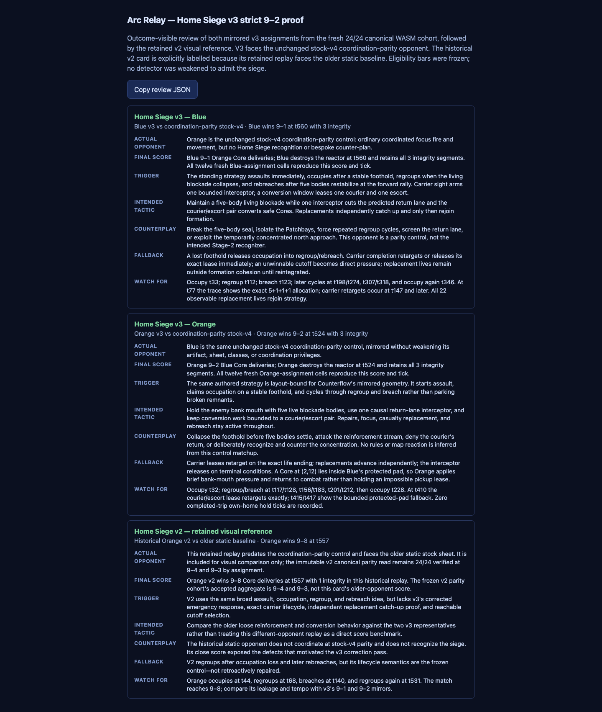

# Arc Relay Home Siege v3 — strict 9–2 correction

Date: 2026-08-04  
Branch: `codex/arc-strategy-ladder`  
Implementation/evidence commit: `9fe640b6`  
Candidate implementation commit: `3a1fb202`  
Pre-outcome freeze commit: `721168ae`

## Outcome

Home Siege v3 clears the requested gate against the unchanged stock-v4
coordination-parity control:

| Assignment | Fresh canonical cells | Result in every cell | Final integrity | End tick |
| --- | ---: | ---: | ---: | ---: |
| Siege as Blue / team 0 | 12 | 9–1 reactor win | 3 | 560 |
| Siege as Orange / team 1 | 12 | 9–2 reactor win | 3 | 524 |
| Combined | **24 / 24** | **all at least 9–2** | **all at least 3** | — |

All 24 cells ran on the sandboxed WASM lane, reproduced byte-identically on
verification, remained cohort-eligible for both teams under the unchanged v4
felt-degeneracy bars, and recorded no runtime fault. The canonical sweep took
108.615 seconds with four concurrent workers. This is a strategy/framework
proof against the registered control, not a fun or general-balance claim.

V2 is retained byte-for-byte as the immutable reference. Its accepted
24-match WASM read was 9–4 with Siege on team 0 and 9–3 with Siege on team 1.
V3 therefore improves the worst score from 9–4 to 9–2 while also retaining all
three integrity segments in every fresh cell.

## Frozen surfaces

The correction did not change Counterflow, Arc Relay rules, class
composition, stock-v4 opponent, eligibility thresholds, or the approved
allocation. It did not edit or replace any v2 file or evidence artifact.

The accepted v3 identity is:

| Surface | SHA-256 |
| --- | --- |
| tactical WASM | `3f330f6c95b279d44e3741e05cc8d5a13e51a9ca5f481f7a80d4668166eec6c3` |
| concise playbook JSON | `3829ce7cacb30a13543d3f4846b731c6a63cec4c22ddd5c994313fbe9b4e78e1` |
| exact-bound Counterflow layout | `89c92e7091b6c66a31bf56c09d624746c2c06aa760ca6c96c0ebe469836fb3e7` |
| compiled ATP | `ef75a4a6c072e0d97aae490d8526ceea2be4129f7952fc32e671504286ecc425` |
| unchanged stock-v4 WASM | `999183019785e9aac163ed607d43ed5fd6efa903264f216362e4f84711203b0f` |
| unchanged v4 bars | `be728f90a22c36b087cd056ef4efd8bb6ca8400933ddf7fe277c35824a9cb5ef` |

The candidate, runner hashes, exact 5+1+1+1 formula, hard thresholds, and 12
fresh seeds were frozen before any final outcome in
`home-siege-v3-candidate-02-freeze.json` and
`home-siege-v3-final-cohort-02.json`.

## Generic corrections

The implementation remains editor-shaped playbook grammar rather than
Siege-named runtime code:

1. Emergency Core handling is Core-specific. It tries an immediate legal,
   reservation-stable pickup route; when protected terrain or live traffic
   makes pickup impossible, it falls through to the authored combat order
   instead of holding an impossible lease.
2. Courier/escort tasks can arm on any friendly carrier and pin the exact
   carrier life. Bank, drop, death, or invalidation immediately retargets to
   the next deterministic friendly carrier or releases the lease when none
   remains.
3. Replacement lives are excluded from formation cohesion until they reach
   the authored reintegration distance. Slowest-member pacing advances the
   farthest replacement while established bodies wait, so a respawn catches
   up independently instead of parking near home.
4. The single interceptor predicts one tile along the observed return route
   only when it can reach that tile no later than the carrier. Otherwise it
   applies direct pressure. The task keeps causal last-seen memory and
   terminal release semantics.

The playbook still describes exactly five primary living-blockade bodies, one
interceptor, one courier, and one escort. The final canonical traces contain
312 ticks where all three auxiliary leases coexist with eight live bodies,
leaving exactly five unleased primary bodies.

## Strict replay audit

The tracked v2 audit script now reads canonical mind traces in addition to the
compact broadcast. The 24-cell result is:

| Proof | Canonical evidence |
| --- | ---: |
| exact 5+1+1+1 ticks | 312 |
| exact carrier-life retarget ticks | 36 |
| completed-trip courier/escort own-home hold ticks | **0** |
| bounded interceptor active ticks | 2,808 |
| cutoff ticks using causal last-seen rather than current sight | 276 |
| emergency pickup-fallback commands | 24 |
| longest consecutive replacement own-home wait | **1 tick** |
| deaths followed by a replacement life | 492 |
| replacement lives rejoining strategy | **492 / 492** |
| cells with occupy → regroup → breach recovery | **24 / 24** |
| accepted repair commands | 1,728 |
| subject body-ticks in opponent final third | 63,216 |
| Core banks while five-body camp active | 216 subject / 12 counter |

Formation, focus fire, repairs, casualty replacement, regroup/rebreach,
recovery, conversion, and stable forward occupation are present in every
assignment family. The scheduler regression also directly proves the other
exact-carrier branch: when no replacement carrier exists, courier and escort
release on that same lifecycle evaluation.

### The protected-pad Core

The recurring south Core at `(2,12)` is inside the opponent's protected
three-column home pad. Opposing ground bodies cannot legally enter that tile.
The strict requirement is conditional on a legal recovery body, so the Core is
not falsely counted as a reachable sanitation failure.

V3 nevertheless reacts: the runner issues two accepted bounded fallback
moves at the bank mouth, then returns to combat/formation; it does not wait on
an impossible pickup. A post-freeze control that completely ignored this Core
fell to an 8–3 timeout and a 7–3 timeout. That control was rejected and the
frozen candidate restored byte-for-byte. Voluntary drop is not used for
sanitation and no drop/re-pick loop was introduced.

## Attempts and two-speed method

Development used in-process screens on both assignments only for iteration.
Every material variant remains in
`home-siege-v3-development-screen-ledger.json`, including rejected direct
pickup priorities, focus matrices, formation rings, blind lead pursuit,
free-pace replacement routes, unconditional carrier release, and the
post-freeze protected-pad exclusion control.

Only the selected candidate advanced to the distinct pre-outcome freeze. The
12 fresh final seeds were never screened. The final 24-cell block was then run
once across both assignments on WASM with no selective reruns.

## Outcome-visible review gallery

Public review URL:

**https://ballot-automotive-fits-dolls.trycloudflare.com/**

This is a public, unauthenticated Cloudflare quick tunnel with no uptime
guarantee. The gallery contains:

- Blue v3 vs unchanged coordination-parity stock-v4: 9–1;
- Orange v3 vs unchanged coordination-parity stock-v4: 9–2; and
- the retained historical v2 visual reference, explicitly labelled as using
  the older static opponent rather than parity control.

Every card states the actual opponent, result, trigger, intended tactic,
counterplay, fallback, and causal moments to watch. The gallery is
outcome-visible. It is not used as cohort evidence.

| Gallery check | Result |
| --- | ---: |
| replays | 3 |
| v4-eligible sources | 3 / 3 |
| compressed replay total | 458,989 B / 8 MiB |
| largest compressed replay | 161,892 B / 300 KiB |
| exact public-URL browser smoke | 3 / 3 WebGL |
| playback advanced / score bug present | 3 / 3 |
| browser, console, or request errors | 0 |
| index and replay transport | HTTP 200, gzip |

## Verification

| Check | Result |
| --- | --- |
| fresh canonical WASM cohort | 24 / 24 verified, eligible, no faults |
| strict trace audit | pass |
| full `scripts/test.sh` | pass; 2,050 .NET tests, 84 PostgreSQL-gated skips; script checks pass |
| Engine + DocDrift | 1,365 / 1,365 pass |
| CLI including lifecycle regression | 285 / 285 pass |
| canonical fingerprint goldens | 7 / 7 current cases pass, including the six retained historical pins |
| web tests | 399 / 399 pass |
| production web + four CLI viewers + parked WebGL build | pass |
| gallery builder eligibility enforcement | 3 / 3 pass |
| local and exact-public-URL browser smoke | pass |
| `git diff --check` | pass |

The test run also refreshed the tracked built-in WASM artifact from the
already-landed SDK/movement inputs; this does not alter the frozen Home Siege
candidate, opponent artifact, rules, map, or any canonical result above.

## Retained evidence

- `home-siege-v2-reference-freeze.json`: immutable v2 assets and accepted read.
- `home-siege-v3-candidate-02-freeze.json`: pre-outcome candidate and hard gate.
- `home-siege-v3-final-cohort-02.json`: entrants, hashes, and fresh seed basis.
- `home-siege-v3-final-cohort-02-plan.json`: exact 24-cell runner plan.
- `home-siege-v3-final-audit-02.json`: cell-level hashes, scores, bars, and traces.
- `home-siege-v3-development-screen-ledger.json`: retained accepted and rejected paths.
- `home-siege-v3-gallery-sample.json` and `home-siege-v3-gallery-cards.json`:
  reproducible outcome-visible review selection and explanation contract.

No numbered decision is minted. The next strategic step remains the separately
authored recognizer/counter-sheet; no map or rules reaction is taken from this
control result alone.
