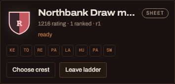
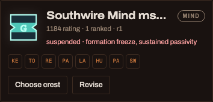
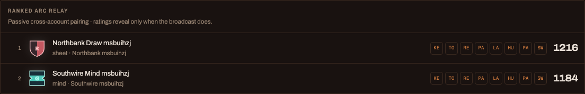
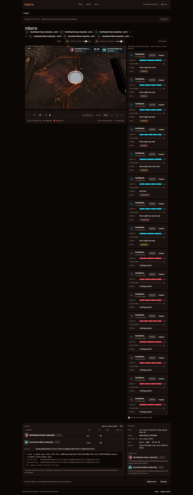

# Arc Relay entrant ladder pass

Date: 2026-08-02

Branch: `codex/game-redesign`

Pre-pass branch tip: `458f7ee9`

## Outcome

The hosted backend and web product now treat a saved sheet and a submitted
custom mind as the same competitive entity: an **entrant** with a stable ID,
name, crest, eight-class composition, revision and Arc Relay rating. The
legacy Duel product surface is retired and read-only; its engine, verifier,
contracts and historical records remain intact.

This pass changes product admission, persistence, APIs and presentation. It
does not change Arc Relay rules, balance, maps, class behavior, canonical
replay content or frozen stock artifacts. No mobile feature UI was added;
mobile's generated API schema moved only through lockstep client generation.

## 1. Entrant model

| Property | Sheet entrant | Custom-mind entrant |
| --- | --- | --- |
| Stable identity | sheet ID and entrant ID are the same | entrant ID owns an internal build record |
| Execution | registered stock artifact, trusted in-process | submitted artifact, sandboxed WASM only |
| Composition | derived from the sheet's eight slots | declared at submission and every revision |
| Admission | valid saved sheet | controlled build, then hosted fault-free preflight |
| Revision | sheet revision | built artifact version |
| Rating | attached to entrant ID | attached to entrant ID |

Saving a sheet revision or resubmitting a mind preserves the entrant ID and
rating. A mind resubmission leaves the ladder and requires a new preflight;
preflight settlement is pinned to both match ID and revision, so an older
validation result cannot admit newer code. Save-as-copy or a new mind
submission creates a fresh entrant and rating.

Composition validation is shared: exactly eight unlocked classes, no more
than two copies of one class. The v1 custom-mind declaration rejects non-empty
adaptive policy or adaptive class fields. Matches snapshot entrant ID, kind,
revision, crest descriptor, composition JSON and composition hash alongside
the existing artifact or sheet hashes.

The EF migration adds `ArcRelayEntrants`, `ArcRelayEntrantRatings` and
`ArcRelayRankedMatches`, adds the entrant/lane snapshots to matches, and
backfills each existing Arc Relay sheet to a same-ID sheet entrant. Database
checks constrain entrant-kind backing data and crest variants; rating and
pairing indexes are explicit. EF reports no model changes after the migration.

## 2. Custom-mind admission and enforcement

Custom-mind source uses the existing controlled submission queue and
toolchain. The build probe admits the generic-mind contract profile, and the
hosted executor materializes the pinned artifact through
`WasmGenericMindRuntimeFactory` with runtime kind
`sandboxed-wasm-mind-v1`. It never enters the trusted in-process branch. The
only in-process path is the registered, hash-pinned Arc Relay stock artifact
used by sheets and the preflight fixture.

Preflight is a real hosted match against a stable stock fixture. Zero runtime
faults admits the exact revision; faults fail it. A ranked result is also read
by the registered felt-degeneracy bars. A trip immediately removes the
entrant from server-side pairing and records the reasons. Its public card and
ladder row conceal that result-derived suspension until the match's causal
broadcast completes, then disclose the suspension and source match.

The production smoke's intentionally passive fixture demonstrated this
separation: it passed runtime preflight, entered and completed one ranked
match, received its rating update, then disclosed suspension for `formation
freeze, sustained passivity`.

## 3. Rating and passive pairing

Arc Relay entrant Elo is an exact-compatible rating policy with a 1200 start.
Settlement is an idempotent background job that refuses to run before the
match broadcast is complete. Scrimmages are same-account only and always
unrated.

The passive worker runs every 30 seconds under the existing PostgreSQL
admission lock. Each pass:

- considers opted-in, non-suspended, admission-ready entrants;
- pairs only different accounts;
- orders candidates by rating distance, then stable entrant ID;
- avoids the same opponent for 24 hours;
- permits at most 6 matches per entrant per rolling day;
- creates at most 4 pairings per pass and never exceeds 16 queued/running
  ranked matches;
- enforces a combined maximum of 3 opted-in entrants per account.

Sheet-vs-mind is ordinary. Revision/artifact and composition snapshots in the
match record determine what actually ran; the rating remains on the entrant.

## 4. API and product surface

The Arc Relay API now exposes the shared entrant roster, public ladder,
sheet/mind creation and revision, mind preflight, crest choices, ladder
opt-in and unrated scrimmages. Endpoint types generated the checked-in web,
mobile and CLI clients through `scripts/generate-api-clients.sh`.

The web front door and primary navigation now center `/relay`, `/watch` and
`/docs`. `/bots`, `/garage`, old rankings and old look routes no longer expose
creation, submission or Duel queue actions. Historical bot pages, match sets
and replays remain reachable below `/archive/*`, labelled as legacy and
read-only. The old challenge and ranked Duel admission endpoints return HTTP
410 with a retired explanation when the production gate is off. Internal
engine identifiers, the nilbots brand and CLI names are unchanged.

The text-only `/llms.txt` and `/llms-full.txt` product guides now describe Arc
Relay entrants and plainly point to the legacy archive. Internal backing build
records for custom minds are excluded from legacy bot list/detail responses.

## 5. Crest, composition and score presentation

Every crest is reproducible from `SHA-256(entrant ID + selected variant)`.
The grammar chooses one of five silhouettes, five patterns, eight marks and
eight palettes. The server stores only the selected variant, returns eight
nearby choices to the picker, and snapshots the resolved descriptor into a
match. The same component renders it on cards, ladder rows and match headers;
the 2D and parked 3D viewers also place it on the owner's reactor.

The roster and ladder render the same eight-slot composition strip for both
kinds. The custom-mind editor exposes eight unlocked-class selectors and
prevents a third copy in the UI in addition to server validation.

The persistent sports-style score bug renders only state at or before the
playhead: both snapshotted crests and entrant names, three reactor-integrity
segments, three current-charge pips, eight composition marks and the match
clock. It is shared by hosted and gallery replay viewers and follows causal
prefixes. Gallery indexes remain outcome-blind. Ranked Arc Relay matches now
carry the correct ranked standing strip rather than the legacy unranked label.

## 6. Production browser smoke

The tracked smoke harness is `scripts/smoke-arc-relay-entrants.mjs`. It served
the production web build from the real app against a fresh dedicated
PostgreSQL database, used two independent browser cookie contexts, and drove:

1. two account registrations;
2. a sheet entrant and procedural crest selection;
3. a custom-mind entrant from fixture C# source through the real compiler;
4. hosted preflight on the sandboxed WASM runtime;
5. opt-in and cross-account passive pairing;
6. completed ranked execution, causal settlement and updated ladder ratings;
7. a watched match with ranked header and live score bug;
8. a primary-navigation assertion with no bot-era entry points.

| Evidence | Value |
| --- | --- |
| Sheet entrant | `469250e9-4774-4946-85e8-b66b4e8a05f6` |
| Mind entrant | `b13db2bc-9004-41a8-aa58-33a05d679eb7` |
| Preflight match | `c3dc6f07-db61-4876-a9d9-2e29e03e866b` |
| Ranked match | `744c1ff0-d0b2-4731-afc4-f0877b78101c` |
| Canonical replay SHA-256 | `45ed6c6b95225d94c13f75c7a70b7e31d808dec50877d51f7134862c8d175375` |
| Sheet rating | 1216, 1 ranked match |
| Mind rating | 1184, 1 ranked match, post-hoc suspended |

The harness advanced only the disposable smoke database's presentation clock
and already-scheduled settlement availability so the headless run did not wait
two real hours. It did not alter replay bytes or result facts. The disposable
database was dropped after evidence capture.

### Review screenshots

Sheet card:

Mind card:

Ladder:

Score bug:

Hosted match:

## 7. Size and runtime ledger

No gameplay field was added to the canonical broadcast. The final smoke replay
is 50,689 B compressed (2,065,101 B expanded), below the 300 KiB per-match
budget. Entrant facts live in match/API snapshots rather than the replay body.

The previous tracked production ledger is the after-state in
`PRESENTATION-ART-PASS-REPORT.md`. This pass reuses the same art/model payloads.

| Production artifact | Previous ledger | Entrant pass | Delta |
| --- | ---: | ---: | ---: |
| Main hosted JS | 1,258,212 B | 1,246,494 B | -11,718 B |
| Hosted CSS | 58,622 B | 64,580 B | +5,958 B |
| Parked 3D lazy chunk | 749,679 B | 750,837 B | +1,158 B |
| Entire `web/dist` | 43,316 KiB | 43,308 KiB | -8 KiB |
| Four CLI viewers | 24,302,747 B | 24,281,088 B | -21,659 B |
| Screenshot evidence, five PNGs | — | 808,634 B | report-only |

The hosted sheet execution probe measured 1.514 seconds steady in a Debug
PostgreSQL test run (1.395 seconds simulation). Its 2-second regression ceiling
still fails a return to build-per-sheet or WASM sheets; production Release
capacity measurement remains a deployment concern rather than a rules change.

## 8. Determinism and verification

The six Phase D golden cells were regenerated through the tracked WASM sweep
harness with three workers after the entrant work. All six canonical hashes
matched byte-for-byte in 33.240 seconds; no golden manifest change remains:

| Cell | Canonical SHA-256 |
| --- | --- |
| convoy / information-route-control | `1661522b6eb3af8f05834f74c6665c69618ca142c5bba4dee26c7b190edd2f0e` |
| convoy / interception | `b0433312f8f2188435b086bce139eabb9d5618411d12cde53b40584a4a9eafbb` |
| convoy / split-control | `37d7f726b992b606745246a493e93f93d6a0608608f993fde2421645c4dfa27c` |
| information-route-control / interception | `28acb15cadb60ecdf2fd0988e794af0c44d69893e5d1374a580031b39d399966` |
| information-route-control / split-control | `1680c38dea521c2b2951f63bc025c0b28f61836d39625b5b644368ab27987605` |
| interception / split-control | `cda2fdb628ef71e5a523cd196031c490d2dc4b2d696b8e4f0376af2be50e2b20` |

| Gate | Final result |
| --- | --- |
| `dotnet test BotArena.sln --no-restore` | 1,865 passed; 82 environment-gated skipped |
| PostgreSQL category, required | 79 passed; 0 skipped |
| Web tests | 355 passed; 0 skipped |
| Production web + four CLI builds | pass |
| API client generation | web, mobile and CLI generated cleanly |
| EF pending model check | no pending changes |
| DocDrift | pass within the 1,357-test engine suite |
| Golden canonical replay hashes | 6/6 byte-identical |
| `git diff --check` | pass |

## Review boundary

The requested implementation and evidence are present. Acceptance remains an
owner taste/product decision for the crest grammar, shared entrant cards,
ladder presentation and retired navigation.
