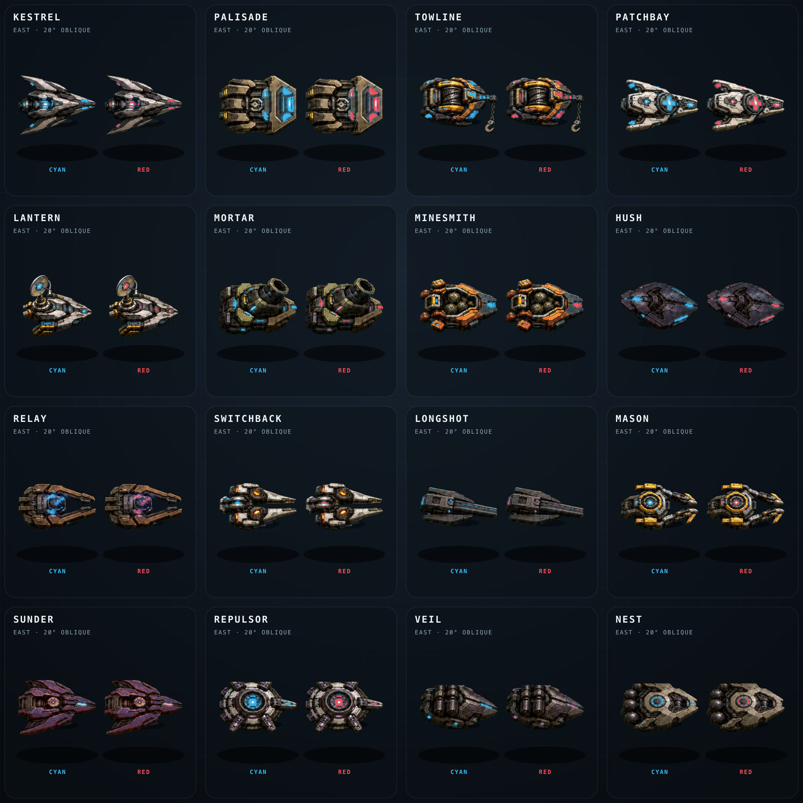
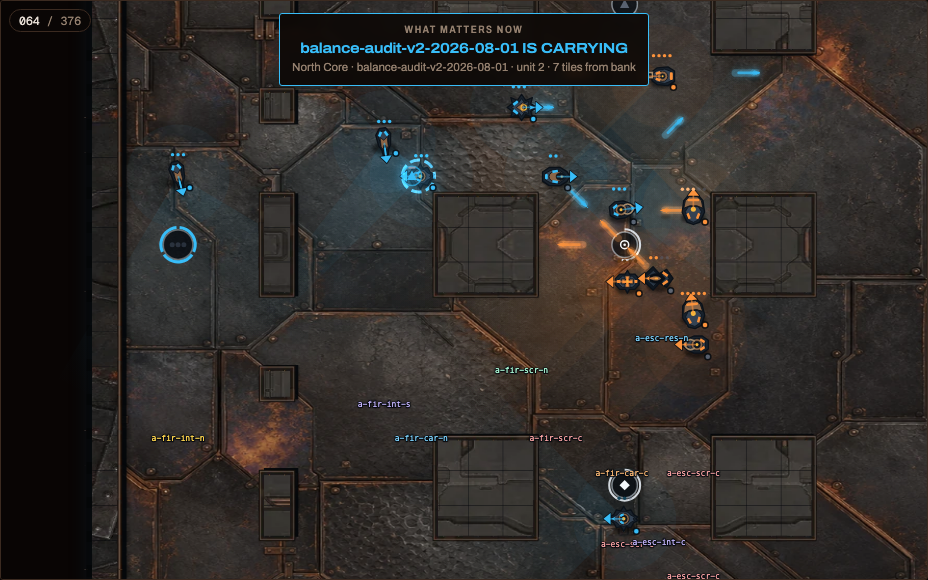
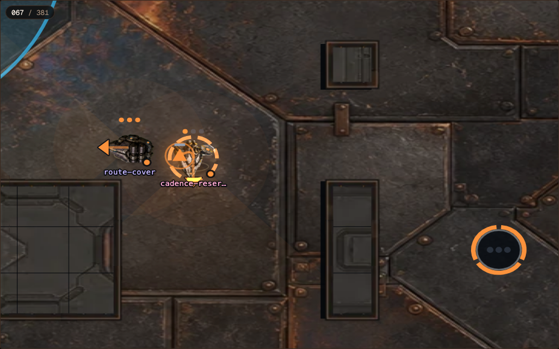
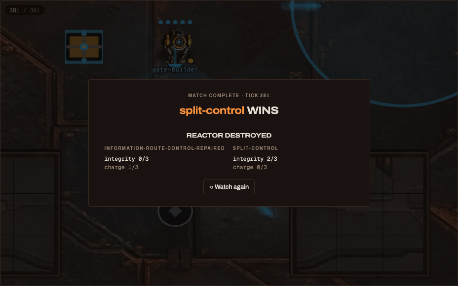

DECISION NEEDED: Re-watch the fresh twelve-match outcome-blind gallery and
approve, revise, or reject the presentation pass and sixteen-class contact
sheet. The requested presentation and art work is complete. Art remains an
owner taste call, and no fun claim is made here.

# Arc Relay presentation + class art pass

## Result

Arc Relay's Canvas2D viewer is now diegetic during play. The former event
banners, persistent “what matters now” prose, and Arc event-feed text are gone.
Core birth, steal, bank, and Pulse are instead expressed by authoritative
in-world graphics and distinct, position-panned sounds. The carrier, Core,
Wells, Reactors, integrity, charge, bank, and Pulse state remain visible in the
world itself.

Movement is tweened only along each authoritative tick-to-tick segment.
Recoil, impacts, facing, and other action accents use a separate eased fraction;
visibility and discrete state still change at their authoritative tick. All
playback rates are 50% slower than before this pass: 2.5 rather than 5 replay
ticks per second at `1x`.

The former whole-map `fit` is an outcome-blind auto-director. It prioritizes a
carrier nearing a bank, then an active fight, a loose-Core contest, the next
Well birth, and finally the nearest opposing pair. It uses only facts revealed
at or before the playhead and moves through the existing damped camera spring.
The same control exposes the full strategic overview immediately; manual camera
input yields control to the viewer.

The arena now uses a genuine mild oblique presentation rather than the earlier
mislabelled top-down Y squash. The world projection vertically compresses the
plan plane by `0.9`, while walls expose displaced tops and visible side faces.
More importantly, every new class source is itself shallow-oblique: it shows a
narrow hull side, dark underbody or air gap, raised signature hardware, and a
tight contact shadow. It is not isometric. One East-facing sprite per class is
still rotated by the renderer for all eight headings, and exact tile occupancy,
routes, fog truth, and inverse pointer hit-testing remain grid-owned.

The result screen again identifies the winner, reactor destruction versus
horizon ranking (or fault eligibility), and final integrity and charge for both
teams. Those facts were already in the latest broadcast slice, so this pass did
not enlarge or reinterpret canonical replay content. Gallery indexes remain
outcome-blind.

Sixteen distinct class bodies, sixteen matching signature-effect stamps, and
one shared Arc Pulse projectile now ship. The bodies use a measured PNG
exception because the reproducible vector interpretation lost the approved
concept's material separation, texture, and shallow depth at gameplay scale.
The compact raster bodies retain that finish; team color remains a separate
semantic mask composited and glowed by the renderer. Effects and Arc Pulse
remain genuine SVG. There are no per-bot animation frames.

Mobile-specific polish was deliberately deferred. The same 3D-capable web
client still compiles; its parked lazy renderer chunk is byte-identical to the
baseline.

## Evidence

### 1. Diegetic presentation

| Beat | In-world visual | Event audio |
| --- | --- | --- |
| Core birth | Well-centred bloom and expanding acquisition rings | rising foundry arpeggio |
| Core steal | inward-snapping ownership ring at pickup | descending latch/transient |
| Core bank | team-accented hex lock and charge pips at the bank | three-part mechanical lock |
| Pulse | field sweep and opposing-reactor strike | charged impact with long tail |

The four cues are deterministic 48 kHz stereo AAC synthesized by
`scripts/generate-arc-relay-sfx.mjs`. Unit coverage binds each sound to its
explicit public event. The final production browser smoke crossed the bank at
replay tick 66 and observed two real `AudioBufferSourceNode.start()` calls with
SFX enabled. No cue is inferred from score, outcome, or future state.

`ArcRelayStory` was removed and the shared text event feed is suppressed only
for Arc Relay. Other modes retain their existing feed. Presentation facts
remain available to renderers and tests.

### 2. Camera, interpolation, and projection truth

- Position tweening is linear from authoritative tile A to tile B. It cannot
  overshoot, curve, or invent an intermediate route.
- Action easing is separate. Discrete state, hits, vision, fog, and lifecycle
  transitions remain tick-owned.
- Director priority is carrier nearing bank > active fight > loose Core > next
  Well birth > closest opposing pair. A recent fight is held briefly to avoid
  one-frame target flicker.
- Camera pans and zooms use the existing damped spring and deadband. Arc Relay
  preserves a ten-tile narrative window, and the overview is always one toggle
  away.
- Drawing and hit-testing share an invertible projection. Fog and routes stay
  in world coordinates.
- Walls retain their topology atlas and exact occupancy. A displaced top,
  stationary base shadow, and dark vertical face communicate height without
  moving cover or collision.

### 3. Sixteen-class art ledger

| Class | Signature read | Locomotion | Material/palette character |
| --- | --- | --- | --- |
| Kestrel | narrow dart and Falling Star vector | low hover | ivory, rust, dark flight alloy |
| Palisade | broad projector face and wall ribs | treads | pale armor, navy structure, brass projector |
| Towline | exposed drum, cable, and hook jaws | wheels | hazard gold and industrial steel |
| Patchbay | medical cross and field-service core | skids | sage ceramic and warm clinical enamel |
| Lantern | sensor disc, mast geometry, survey rays | low hover | violet sensor ceramic and pale optics |
| Mortar | oversized elevated launch tube | treads | olive artillery plate and worn bronze |
| Minesmith | mine rack, warning wedge, utility wheels | wheels | oxide foundry metal and sand hardware |
| Hush | dampener eye and null-field array | low hover | near-black violet acoustic composite |
| Relay | Core cradle and forward throwing arms | skids | oxblood frame, bronze cradle, pale rails |
| Switchback | mirrored paired chassis | low hover | split ivory/steel frame and paired emitters |
| Longshot | body-length rail and muzzle | skids | cool gunmetal and ivory rail housing |
| Mason | block bay and builder fork | treads | construction ochre and concrete-grey tooling |
| Sunder | target-designator optic and crosshair | low hover | plum optics and pale calibration vanes |
| Repulsor | concentric hub and radial emitters | treads | burgundy field coils and warm alloy |
| Veil | paired smoke-launcher pods | low hover | moss stealth plate and muted smoke hardware |
| Nest | visible deployable pods and launch rails | wheels | field green carrier and earthen pod rack |

The fixed-order premium concept, exact prompts, isolation atlas, chroma atlas,
vector fallback, and raster masters are archived under
`art/class-look-concepts/arc-relay/premium-roster-v1/`. The concept was approved
as a whole before production extraction. `scripts/build-arc-relay-class-art.mjs`
then deterministically performs cell extraction, chroma keying and spill
removal, trim and scale normalization, semantic cyan-light separation, Sunder
palette deconfliction, and PNG optimization.

Each package contains a 192×192 `sprite.png`, compact `team-mask.png`, genuine
SVG `effect.svg`, and a `team.svg` source template with named
`underbody-locomotion`, `chassis`, `weapon-hardware`, `team-accents`, and
`emissives` groups. That SVG template is explicitly marked
`data-runtime-art="raster-exception"`; it is a future-rigging map, not a claim
that the embedded body is vector. Cyan/red replaces and glows only the semantic
mask. Authored armor palettes remain class-owned. Sunder's concept-red armor is
shifted to plum so red cannot masquerade as team identity.

The 192-pixel runtime tier was compared against 256- and 384-pixel derivatives.
No meaningful loss was visible at the actual 40–70-pixel match footprint or in
the two-team contact sheet, while the class body payload fell substantially.
High-resolution originals remain art-side for later skins or rerenders.

The shared Arc Pulse is an East-facing white-alpha SVG mask with named trail
and pulse-body groups, tinted through the existing `defaultProjectile`
mapping. Class effects are also genuine SVG and renderer-driven. Movement,
rotation, hover bob, grounded dust/skid cues, recoil, damage flash, fog, and
signature motion remain renderer-owned.

The class build and contact sheet are reproducible with:

```sh
node scripts/build-arc-relay-class-art.mjs
node scripts/render-arc-relay-contact-sheet.mjs
```



### 4. Production browser smoke

`scripts/smoke-presentation-art.mjs` ran against the production Gate 3 viewer
served from the rebuilt gallery. It verified Canvas2D playback in the oblique
projection, absence of the removed prose, the active director and overview
toggle, real WebAudio event playback, the new sprites and team lights on the
field, zero page errors, and a terminal result card.

Machine-readable evidence and screenshot SHA-256 values are archived in
[`assets/presentation-art/smoke.json`](assets/presentation-art/smoke.json).

| Before: flat + prose | After: oblique + diegetic |
| --- | --- |
|  |  |



### 5. Presentation-only polish disclosure

In addition to the explicit requests, the pass adds only:

- a low-hover air gap, tight shadow, and restrained bob;
- planted shadows and restrained dust/skid cues for grounded classes;
- corrected/capped close-camera role captions;
- richer Arc Pulse trail/body separation; and
- event-specific bloom, rings, bank pips, reactor strike, and team glow.

No floor material, fog truth, health value, collision, cover, projectile path,
signature behavior, rule, balance value, doctrine, sheet, evaluation bar, or
contract-owned fingerprint changed. Broader floor/theme and fog restyling are
left as proposals because they need their own taste comparison.

### 6. Replay and gallery proof

The latest eligible twelve-match doctrine set was rebuilt at
`sandbox/arc-relay-presentation-art-review-v1-2026-08-02-engine-1-0-5` with the
new production viewer. It preserves the same outcome-blind index mapping and
verified match records. The broadcast slice did not change because terminal
result facts already existed.

As an independent replay-truth check, the first gallery source record was
regenerated from scratch with `scripts/arc-relay-match.py regenerate`. Its
canonical SHA-256 matched its record byte-for-byte:

`fb685764de735c881b3f72273b8cd6f09c3024fa234d7407629a6928d08ddc10`

| Gallery budget | Measured | Limit | Result |
| --- | ---: | ---: | --- |
| Largest compressed match | 145,278 B | 300 KiB | pass |
| Whole hosted gallery on disk | 6,328 KiB | 8 MiB | pass |
| Match count / eligibility | 12 / all eligible | 12 / all eligible | pass |

### 7. Asset and build size ledger

The baseline was measured from this branch before the pass. Final figures come
from the full production build after the 192-pixel art tier was selected.

| Production artifact | Before | After | Delta |
| --- | ---: | ---: | ---: |
| Main hosted JS | 1,218,391 B | 1,258,212 B | +39,821 B (+3.27%) |
| Hosted CSS | 60,411 B | 58,622 B | -1,789 B (-2.96%) |
| Parked 3D lazy chunk | 749,679 B | 749,679 B | 0 |
| Entire `web/dist` | 42,484 KiB | 43,316 KiB | +832 KiB (+1.96%) |
| Four CLI HTML viewers (sum) | 20,056,339 B | 24,302,747 B | +4,246,408 B (+21.17%) |
| CLI control-room | 5,129,094 B | 6,190,696 B | +1,061,602 B |
| CLI ember-forge | 3,816,723 B | 4,878,325 B | +1,061,602 B |
| CLI frost-relay | 4,281,191 B | 5,342,793 B | +1,061,602 B |
| CLI overgrown-lab | 6,829,331 B | 7,890,933 B | +1,061,602 B |

The sixteen runtime bodies total 699,068 B; team masks 35,139 B; class effects
10,118 B; and manifests 3,547 B. Named-group source templates add 25,896 B to
the repository but are not loaded by the viewer. The four event sounds total
64,320 B. The 1,418,603 B contact sheet and 6,389,052 B concept archive are
review/source material only. Hosted Vite emits bodies as cacheable assets;
single-file CLI viewers necessarily embed them. The CLI increase is disclosed
and remains below the existing largest-viewer asset envelope; no new model is
bundled.

### 8. Verification

| Check | Result |
| --- | --- |
| Web tests | 354/354 pass, including event facts, explicit raster-exception structure, semantic masks, interpolation, camera, and intentional renderer goldens |
| Full production build | pass: four CLI viewers, TypeScript, atlas variants, hosted Vite build |
| Gate 3 production build | pass: Canvas2D, soundtrack-free, 3D-free review bundle |
| Parked 3D compile | pass; lazy chunk 749,679 B, unchanged |
| DocDrift | 24/24 pass |
| Browser smoke | pass; zero page errors, two audio starts, diegetic UI, director, and result card asserted |
| Canonical regeneration | exact recorded SHA-256 match |
| Gallery budgets | pass |
| Runtime PNG exceptions | 16, documented and evidenced at gameplay scale |

## Next

The owner re-watches the twelve blind matches and reviews the two-team contact
sheet. The next action is a taste ruling: approve this treatment, request
specific class revisions, or reject it and choose a new direction. No further
presentation, mechanic, or evaluation work is authorized by this report.
